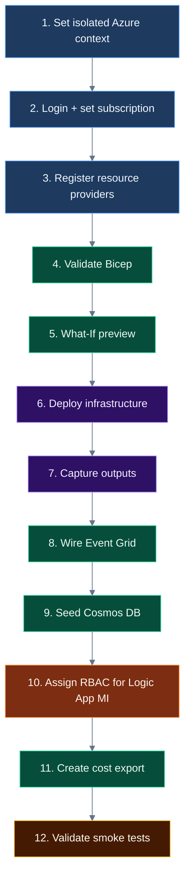
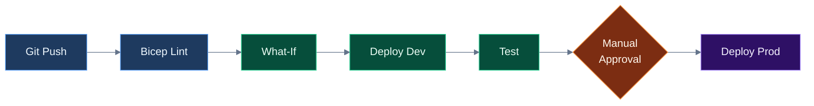

# Blueprint Strategy — Subscription & Platform Setup for Budget Alerts Automation

> **Purpose:** Document every subscription-level enablement, provider registration, RBAC assignment, and platform prerequisite required to deploy the Budget Alerts Automation codebase — so that anyone replicating this in another tenant/subscription knows exactly what to set up.  
> **Date:** March 26, 2026  

---

## 1. Why This Document Exists

The codebase is self-sufficient for deployment — `az deployment sub create` deploys all 9 modules. But the **subscription itself** must be prepared first. This document captures every platform-level setup that lives *outside* the Bicep templates — things that CI/CD pipelines, subscription admins, or future tenant rollouts must handle.

**When you need this document:**
- Deploying to a new subscription or tenant
- Setting up an Azure DevOps / GitHub Actions pipeline
- Onboarding a new team member who needs to deploy
- Troubleshooting `RequestDisallowedByPolicy` or `RP Not Registered` errors
- Preparing for production rollout

---

## 2. Resource Provider Registrations

Azure resource providers must be registered on the target subscription before resources of that type can be created. Registration is **per-subscription** and persists permanently.

| Provider | Required By | Why | Registration Command |
|----------|------------|-----|---------------------|
| `Microsoft.Consumption` | Budget creation (subscription + RG) | Budgets API lives under Consumption | `az provider register --namespace Microsoft.Consumption` |
| `Microsoft.CostManagement` | Cost queries, budget alerts | Cost Management features | `az provider register --namespace Microsoft.CostManagement` |
| `Microsoft.CostManagementExports` | Amortized cost daily export (Phase 5) | Cost export to Storage Account | `az provider register --namespace Microsoft.CostManagementExports` |
| `Microsoft.EventGrid` | Auto-budget Logic App trigger | Event Grid subscription for RG write events | `az provider register --namespace Microsoft.EventGrid` |
| `Microsoft.Logic` | Both Logic Apps | Logic App resource type | `az provider register --namespace Microsoft.Logic` |
| `Microsoft.Insights` | Action Groups, alert rules | Monitoring and alerting | `az provider register --namespace Microsoft.Insights` |
| `Microsoft.Storage` | Budget table + cost export blobs | Storage Account | `az provider register --namespace Microsoft.Storage` |
| `Microsoft.Web` | Function App (amortized engine) | App Service / Functions | `az provider register --namespace Microsoft.Web` |

### Status on MVP Subscription (checked 2026-03-26)

| Provider | Status |
|----------|--------|
| `Microsoft.Consumption` | Registered |
| `Microsoft.CostManagement` | Registered |
| `Microsoft.CostManagementExports` | **Not Registered — must register** |
| `Microsoft.EventGrid` | Registered |
| `Microsoft.Logic` | Registered |
| `Microsoft.Insights` | **Not checked — must register** |
| `Microsoft.Storage` | Registered |
| `Microsoft.Web` | Registered |

### Bulk Registration Script

```powershell
# Run once per subscription — idempotent, safe to re-run
$providers = @(
    "Microsoft.Consumption",
    "Microsoft.CostManagement",
    "Microsoft.CostManagementExports",
    "Microsoft.EventGrid",
    "Microsoft.Logic",
    "Microsoft.Insights",
    "Microsoft.Storage",
    "Microsoft.Web"
)
foreach ($p in $providers) {
    az provider register --namespace $p
    Write-Host "Registered: $p"
}
# Propagation can take up to 10 minutes
```

### CI/CD Pipeline Implication

Add this as the **first stage** in any pipeline that deploys to a new subscription:

```yaml
- stage: RegisterProviders
  jobs:
    - job: Register
      steps:
        - script: |
            az provider register --namespace Microsoft.Consumption
            az provider register --namespace Microsoft.CostManagement
            az provider register --namespace Microsoft.CostManagementExports
            az provider register --namespace Microsoft.EventGrid
            az provider register --namespace Microsoft.Logic
            az provider register --namespace Microsoft.Insights
            az provider register --namespace Microsoft.Storage
            az provider register --namespace Microsoft.Web
```

---

## 3. RBAC Requirements

### 3.1 Deploying Identity (Service Principal or User)

The identity running `az deployment sub create` needs:

| Role | Scope | Why | Built-in Role ID |
|------|-------|-----|-----------------|
| **Contributor** | Subscription | Create RG, deploy all resources | `b24988ac-6180-42a0-ab88-20f7382dd24c` |
| **Resource Policy Contributor** | Subscription | Create + assign policy definitions | `36243c78-bf99-498c-9df9-86d9f8d28608` |
| **Cost Management Contributor** | Subscription | Create/update budgets | `434105ed-43f6-45c7-a02f-909b2ba83430` |

> **Note:** `Contributor` at subscription scope includes permissions to create policies and budgets in most configurations. Explicit policy/cost roles are needed only if custom deny assignments restrict Contributor.

### 3.2 Logic App Managed Identity (Post-Deployment)

After deployment, the auto-budget Logic App needs its system-assigned managed identity granted:

| Role | Scope | Why |
|------|-------|-----|
| **Cost Management Contributor** | Subscription | So the Logic App can create budgets on new RGs |

**This requires Owner or User Access Administrator** — which the deployer typically does not have. This is a handoff item for the subscription admin.

```bash
# The subscription admin runs this after deployment:
principalId=$(az logic workflow show \
  -g rg-finops-budget-mvp \
  -n la-finops-auto-budget-mvp \
  --query "identity.principalId" -o tsv)

az role assignment create \
  --assignee-object-id $principalId \
  --assignee-principal-type ServicePrincipal \
  --role "434105ed-43f6-45c7-a02f-909b2ba83430" \
  --scope "/subscriptions/<YOUR_SUBSCRIPTION_ID>"
```

### 3.3 CI/CD Service Principal

For Azure DevOps or GitHub Actions:

| Role | Scope | Why |
|------|-------|-----|
| **Contributor** | Subscription | Deploy resources |
| **User Access Administrator** | Subscription | Assign RBAC to Logic App MI automatically |
| **Resource Policy Contributor** | Subscription | Policy definitions + assignments |

Create the service connection:
```bash
az ad sp create-for-rbac \
  --name "sp-finops-budget-cicd" \
  --role Contributor \
  --scopes /subscriptions/<YOUR_SUBSCRIPTION_ID>
```

---

## 4. Tag Policy Compliance

Many organization subscriptions enforce tags via Azure Policy (deny effect). Deployment will fail with `RequestDisallowedByPolicy` if required tags are missing.

### Required Tags (Organization Standard)

| Tag | Required | Effect | Our Value (MVP) |
|-----|----------|--------|----------------|
| `Owner` | Yes | Deny if missing | `FinOps-Team` |
| `CostCenter` | Yes | Deny if missing | `HybridCloud-FinOps` |
| `environment` | Yes | Deny if missing | `mvp` |
| `finops-platform` | No | — | `budget-alerts-automation` |
| `managed-by` | No | — | `platform-team` |
| `Purpose` | No | — | `platform-deployment` |
| `DecommissionAfter` | No | — | `2026-06-30` |

All tags are set in `parameters/mvp.bicepparam` and propagated to every resource by every Bicep module.

### How to Check Tag Policies on a Subscription

```bash
az policy assignment list \
  --query "[?contains(displayName,'tag') || contains(displayName,'Tag')].{Name:displayName, Effect:parameters}" \
  -o table
```

---

## 5. What Gets Deployed (Traceability to Requirements)

### 5.1 Module → Requirement → Framework Section Mapping

| # | Bicep Module | Resource Created | FinOps Req | Framework § | Dev Plan ID |
|---|-------------|-----------------|------------|-------------|-------------|
| 1 | `action-group.bicep` | Action Group (email + Teams) | — (infra) | §8 | QW-01 |
| 2 | `budget.bicep` | Subscription budget (5 thresholds) | B2 (thresholds) | §4, §7 | QW-02 |
| 3 | `policy-definition.bicep` | AuditIfNotExists policy | B3 (capture method) | §6.3 | QW-04 |
| 4 | `policy-assignment.bicep` | Policy assignment to subscription | B3 (capture method) | §6.3 | QW-04 |
| 5 | `storage-account.bicep` | Storage (table + blob container) | B1 (amortized infra) | §9.3 | LT-03 |
| 6 | `logic-app-auto-budget.bicep` | Auto-budget on new RG creation | B3 (new RG method) | §6.2 | MT-01 |
| 7 | `logic-app-budget-change.bicep` | Self-service budget change portal | B4 (change process) | §10 | MT-02 |
| 8 | `event-grid.bicep` | Event Grid sub for RG write events | B3 (new RG method) | §6.2 | MT-01 |
| 9 | `function-app.bicep` | Amortized cost engine (Python) | B1 (amortized alerts) | §9.2 | LT-01 |

### 5.2 Scripts (Not in Bicep — Run Separately)

| Script | Purpose | FinOps Req | When to Run |
|--------|---------|------------|-------------|
| `Invoke-BudgetBackfill.ps1` | Bulk-create budgets for existing 8,000 RGs | B3 (existing RGs) | After infra deployment |
| `Initialize-BudgetTable.ps1` | Seed Azure Table with budget targets | B1 (amortized data store) | After infra deployment |
| `New-AmortizedExport.ps1` | Create daily amortized cost export | B1 (amortized data) | Day 1 (data needs 1 week) |
| `Invoke-QuarterlyRecalc.ps1` | Re-adjust budgets from actuals | — (operational) | Quarterly |

### 5.3 Queries (Not Deployed — Used in Dashboards)

| Query | Purpose | FinOps Req | Used In |
|-------|---------|------------|---------|
| `budget-compliance.kql` | RGs without budgets (ARG) | B3 (visibility) | Azure Portal / Power BI |
| `spend-vs-budget.sql` | Spend vs Budget by BU/cost center | B5 (dashboard) | Snowflake → Power BI |

---

## 6. The 5 FinOps Requirements — Coverage Verification

Cross-checked against implementation-actions, framework, and codebase:

| # | Requirement | Covered By | Code Artifact | Verified |
|---|-------------|-----------|---------------|----------|
| **B1** | Budget alerts on amortized cost | Azure Function + Cost Export pipeline | `functions/amortized-budget-engine/function_app.py` + `New-AmortizedExport.ps1` | Yes — 14/14 pytest pass |
| **B2** | Threshold % based on spend | 5 escalating thresholds in budget module | `infra/modules/budget.bicep` (50/75/90/100/110%) | Yes — built into notifications block |
| **B3** | Method for existing + new RGs | Backfill script + Event Grid + Policy | `Invoke-BudgetBackfill.ps1` + `logic-app-auto-budget.bicep` + `policy-definition.bicep` | Yes — 3 layers |
| **B4** | Process to change budget | Self-service Logic App + Teams card | `logic-app-budget-change.bicep` + `teams-adaptive-card.json` | Yes — floor €100, cap 3x, approval for >2x |
| **B5** | Dashboard: Spend vs Budget | KQL + Snowflake SQL queries | `queries/budget-compliance.kql` + `queries/spend-vs-budget.sql` | Yes — 4 KQL + 4 SQL queries |

---

## 7. Known Gaps & Workarounds

Identified during self-sufficiency audit (dev plan SS-01 through SS-07):

| # | Gap | Impact | Workaround | Status |
|---|-----|--------|------------|--------|
| SS-01 | Unicode in PS scripts | Scripts fail on Windows PowerShell | All non-ASCII replaced with ASCII | Fixed in codebase |
| SS-02 | Event Grid not in main.bicep | Auto-budget trigger not deployed | Module added to orchestrator | Fixed in codebase |
| SS-03 | Pipeline missing variables | CI/CD fails | 6 variables added | Fixed in codebase |
| SS-04 | Logic App missing JSON schema | Parse action fails | Full schema added | Fixed in codebase |
| SS-05 | Tags not policy-compliant | Deployment rejected | Tags in bicepparam | Fixed in codebase |
| SS-06 | CostManagementExports not registered | Export creation fails | Provider registration in pipeline | **Must register before Phase 5** |
| SS-07 | Storage shared key access | Cost export auth fails | `allowSharedKeyAccess` configurable in Bicep | Documented |
| RBAC | Logic App MI needs Cost Mgmt Contributor | Auto-budget can't create budgets | Subscription admin runs 1 CLI command post-deploy | **Handoff item** |
| Event Grid | Callback URL is placeholder during deploy | Auto-budget not wired | Post-deploy script updates URL | **Post-deploy step** |

---

## 8. Deployment Sequence (Exact Order)



---

## 9. CI/CD Pipeline Considerations

When your team takes this to Azure DevOps or GitHub Actions:

| Concern | What to Handle | Where |
|---------|---------------|-------|
| **Provider registration** | Must be first pipeline stage (idempotent) | `pipelines/azure-pipelines.yml` Stage 1 |
| **Service connection** | SP needs Contributor + UAA + Policy Contributor | Azure DevOps project settings |
| **Environment gates** | Manual approval required for prod | Azure DevOps Environments |
| **Event Grid wiring** | Post-deploy task in pipeline | Stage 3 (post-deployment) |
| **RBAC assignment** | Pipeline SP with UAA can auto-assign Logic App MI role | Stage 3 (post-deployment) |
| **Secrets** | Teams webhook URI must be pipeline variable (secret) | Pipeline variable group |
| **Multi-subscription** | One bicepparam per subscription, loop in pipeline | Parameter matrix |

Existing pipeline (`pipelines/azure-pipelines.yml`) already has 5 stages:
```
Validate → Deploy Dev → Deploy Function → Test → Deploy Prod
```

---

## 10. Cleanup & Decommission

When the MVP is no longer needed (after the team promotes to staging/prod):

```powershell
# Delete the MVP resource group and all resources inside
az group delete --name rg-finops-budget-mvp --yes --no-wait

# Remove the subscription budget
az consumption budget delete --budget-name finops-sub-budget-dev

# Remove the policy assignment (policy definition can stay for reuse)
az policy assignment delete --name finops-audit-rg-without-budget-dev

# Remove the isolated Azure config directory
Remove-Item -Recurse -Force "$env:USERPROFILE\.azure-finops"
```

The `DecommissionAfter: 2026-06-30` tag on all resources serves as a reminder.

---

## 11. Automation Vision — From MVP to Production

### Current State (MVP)

| Process | How | Manual Steps |
|---------|-----|-------------|
| Amortized cost export | Scheduled once in portal | One-time setup |
| Finance budget load | CSV → `Set-FinanceBudget.ps1` | Ops runs script |
| Technical budget backfill | `Invoke-BudgetBackfill.ps1` | Ops runs script |
| Function code deploy | Kudu zipdeploy | Manual zip + publish |
| Infrastructure deploy | `az deployment sub create` | Manual CLI |

### Target State (Production)

| Process | How | Manual Steps |
|---------|-----|-------------|
| Amortized cost export | Scheduled via Bicep/ARM (IaC) | Zero |
| Finance budget load | Finance drops CSV to blob → Event Grid → Function auto-ingests | Zero |
| Technical budget backfill | Timer-triggered Function (quarterly) | Zero |
| Function code deploy | CI/CD pipeline (Azure DevOps / GitHub Actions) | PR merge only |
| Infrastructure deploy | CI/CD pipeline with what-if + approval gate | PR merge only |
| New RG budgeting | Event Grid → Logic App (already automated) | Zero |
| Budget changes | Self-service Logic App (already automated) | User request only |
| Alerts | Function → Teams/email (already automated) | Zero |
| Dashboard refresh | Cosmos DB → real-time (already automated) | Zero |

### Finance Ingestion Automation

**Recommended approach: Blob trigger**

1. Create a `finance-budgets/` container in the storage account
2. Add a Blob-triggered Function that parses CSV and upserts to Cosmos DB
3. Finance team gets Storage Blob Data Contributor on that container only
4. They drop CSV → it auto-ingests → Cosmos DB updated → dashboard reflects

**Alternative: SharePoint trigger via Logic App** — if finance prefers SharePoint over Azure portal, a Logic App watches a SharePoint folder and forwards the file to the Function.

### CI/CD Pipeline Design



**Per-subscription resources** (deployed via parameter matrix):
- Azure Budgets, Policy Assignment, Event Grid, Cost Export

**Centralized resources** (single instance, shared):
- Cosmos DB, Function App, Dashboard, Action Group, Storage Account

### Multi-Subscription Scaling

At scale (8,000 RGs across dozens of subscriptions):
- Deploy via Management Group scope where possible
- Cost exports per subscription → all feed into one blob container → one Function processes all
- Cosmos DB partition key = `subscriptionId` → naturally partitioned for multi-sub
- Dashboard aggregates across all subscriptions

---

*This blueprint strategy is the companion to `mvp-implementation.md`. Together they cover: what to prepare (this doc) + how to deploy (mvp-implementation.md). Both trace back to the framework (`budget-alert-framework.md`), development plan, and implementation actions.*
