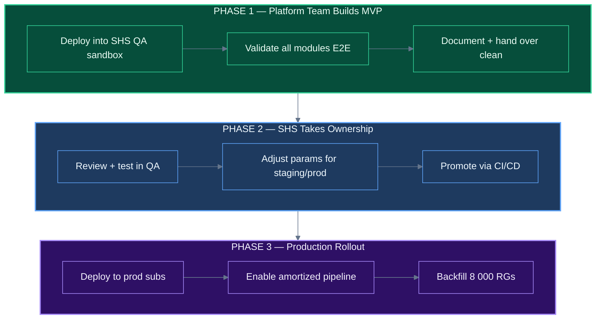
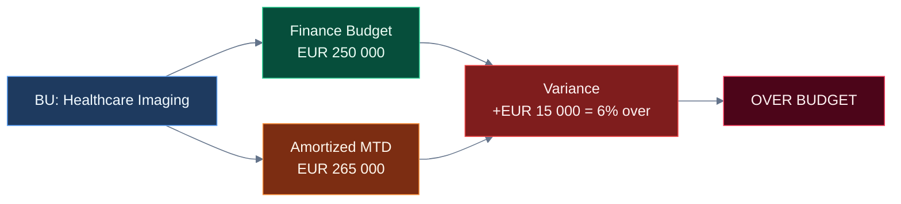
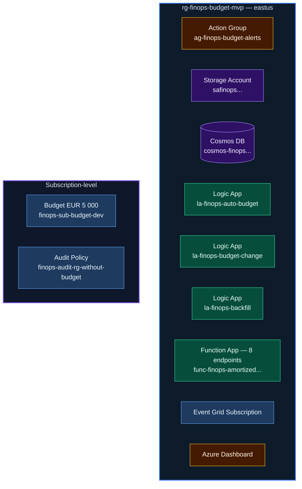
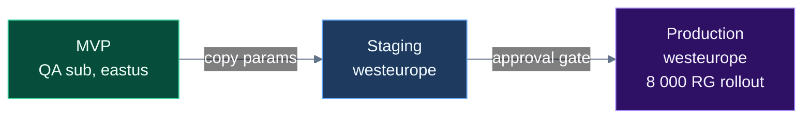

# MVP Implementation Strategy — Budget Alerts Automation

> **Date:** March 2026  

---

## 1. Strategy Overview

### The Handover Model



### Why Sandbox-First

| Reason | Detail |
|--------|--------|
| **No production risk** | QA subscription has no business-critical workloads |
| **Contributor is sufficient** | We can create RGs, deploy resources, set budgets, assign policies |
| **Validates real SHS tenant** | Same Entra ID, same policies, same provider registrations |
| **Clean handover artifact** | SHS gets a working deployment + parameter files they just re-point |

---

## 2. Resource Group & Naming Convention

### Naming Standard

All resources follow your organization's existing naming convention combined with Azure Well-Architected naming:

| Resource | Name | Rationale |
|----------|------|-----------|
| **Resource Group** | `rg-finops-budget-mvp` | Clear purpose, `mvp` suffix signals throwaway/promotable |
| **Action Group** | `ag-finops-budget-alerts-mvp` | Matches existing SHS pattern |
| **Storage Account** | `stfinopsbudgetmvp` | 3-24 chars, lowercase, globally unique |
| **Logic App (Auto-Budget)** | `la-finops-auto-budget-mvp` | Descriptive, dash-delimited |
| **Logic App (Budget Change)** | `la-finops-budget-change-mvp` | Descriptive, dash-delimited |
| **Function App** | `func-finops-amortized-mvp` | Azure Functions naming convention |
| **App Service Plan** | `asp-finops-amortized-mvp` | Consumption plan for Function |
| **Subscription Budget** | `finops-sub-budget-dev` | Budget name (not a resource, but named) |
| **Policy Definition** | `finops-audit-rg-without-budget-dev` | Policy definition at subscription scope |
| **Event Grid Subscription** | `evgs-finops-new-rg-mvp` | Event Grid system topic subscription |

### Tags (Applied to All Resources)

```json
{
  "finops-platform": "budget-alerts-automation",
  "managed-by": "microsoft-csa",
  "environment": "mvp",
  "Owner": "Platform Team",
  "CostCenter": "HybridCloud-FinOps",
  "Purpose": "MVP-validation-before-SHS-handover",
  "DecommissionAfter": "2026-06-30"
}
```

The `DecommissionAfter` tag signals SHS to either promote or delete this RG by end of Q3.

### Location

**`eastus`** — Matches the majority of existing RGs in the QA subscription. Choose the region closest to your existing resources.

> **Note for production:** SHS should switch to `westeurope` or `germanywestcentral` for EU data residency compliance. The `prod.bicepparam` file already has `westeurope`.

---

## 3. RBAC Assessment

### What We Have

| Role | Scope | Status |
|------|-------|--------|
| **Contributor** | Subscription | ✅ Confirmed |

### What We Need vs. What Contributor Covers

| Action | Required Role | Contributor Covers? | Blocker? |
|--------|--------------|--------------------|----|
| Create Resource Group | Contributor | ✅ Yes | No |
| Deploy Logic Apps | Contributor | ✅ Yes | No |
| Deploy Storage Account | Contributor | ✅ Yes | No |
| Deploy Function App | Contributor | ✅ Yes | No |
| Create Event Grid Subscription | Contributor | ✅ Yes | No |
| Create/Update Budgets | Cost Management Contributor | ⚠️ Contributor includes this | No |
| Create Policy Definition | Resource Policy Contributor | ⚠️ Contributor includes this at sub scope | No |
| Assign Policy | Resource Policy Contributor | ⚠️ Contributor includes this | No |
| Assign RBAC to Logic App MI | User Access Administrator | ❌ **Not included** | **Yes — workaround below** |

### RBAC Gap: Logic App Managed Identity

The auto-budget Logic App needs `Cost Management Contributor` on the subscription so it can create budgets. Assigning that role requires `User Access Administrator` or `Owner`, which we don't have.

**MVP Workaround Options:**

1. **Ask SHS admin** to pre-create the role assignment after we deploy the Logic App (1 CLI command)
2. **Deploy without Event Grid trigger** — test the Logic App manually via HTTP trigger instead
3. **Request temporary UAA** — scoped only to the finops RG, time-limited

**Recommended:** Option 1. We deploy everything, then provide SHS the exact command:

```bash
# SHS admin runs this after deployment (needs Owner/UAA):
principalId=$(az logic workflow show -g rg-finops-budget-mvp -n la-finops-auto-budget-mvp --query "identity.principalId" -o tsv)
az role assignment create \
  --assignee-object-id $principalId \
  --role "434105ed-43f6-45c7-a02f-909b2ba83430" \
  --scope "/subscriptions/<YOUR_SUBSCRIPTION_ID>"
```

---

## 4. MVP Parameter File

We'll create a new `parameters/mvp.bicepparam` specifically for this deployment:

```bicep
using '../infra/main.bicep'

param environment = 'dev'                              // Bicep only allows dev/staging/prod
param location = 'eastus'                              // Match existing QA subscription region
param resourceGroupName = 'rg-finops-budget-mvp'       // Dedicated MVP resource group
param finopsEmail = 'your-finops-team@example.com'        // FinOps team email for alerts
param defaultBudgetAmount = 100                        // EUR 100 default for new RGs
param subscriptionBudgetAmount = 5000                  // EUR 5000 sub-level (QA is low spend)
param enableAmortizedPipeline = false                  // Enable AFTER cost export has 1 week of data
param enableAutoBudget = true                          // Core MVP feature
param enableSelfServiceChange = true                   // Core MVP feature
param tags = {
  'finops-platform': 'budget-alerts-automation'
  'managed-by': 'microsoft-csa'
  environment: 'mvp'
  Owner: 'Platform Team'
  CostCenter: 'HybridCloud-FinOps'
  Purpose: 'MVP-validation-before-SHS-handover'
  DecommissionAfter: '2026-06-30'
}
```

---

## 5. Deployment Phases (Step-by-Step)

### Phase 1: Pre-Flight Checks (5 min)

| # | Action | Command | Status |
|---|--------|---------|--------|
| 1.1 | Verify login context | `az account show -o table` | ✅ Done |
| 1.2 | Verify Contributor role | `az role assignment list --all --query "[?principalName=='<YOUR_UPN>']"` | ✅ Done |
| 1.3 | Check resource providers | See Section 6 below | ✅ 5/6 registered |
| 1.4 | Register missing provider | `az provider register --namespace Microsoft.CostManagementExports` | 🔲 To do |
| 1.5 | Verify Bicep CLI | `az bicep version` | 🔲 To do |

### Phase 2: Infrastructure Deployment (10 min)

| # | Action | What It Creates |
|---|--------|----------------|
| 2.1 | **Bicep lint + build** | Validates all 9 modules compile cleanly |
| 2.2 | **What-If preview** | Shows exactly what will be created — review before applying |
| 2.3 | **Deploy** | Creates RG + all 8 resources inside it |
| 2.4 | **Capture outputs** | Store storage account name, Logic App URLs, Action Group ID |

```powershell
# 2.1 — Validate
az bicep build --file infra/main.bicep

# 2.2 — Preview
az deployment sub create `
  --location eastus `
  --template-file infra/main.bicep `
  --parameters parameters/mvp.bicepparam `
  --what-if

# 2.3 — Deploy
az deployment sub create `
  --location eastus `
  --template-file infra/main.bicep `
  --parameters parameters/mvp.bicepparam `
  --name "finops-budget-mvp-deploy"

# 2.4 — Capture outputs
az deployment sub show --name "finops-budget-mvp-deploy" --query "properties.outputs" -o json
```

### Phase 3: Post-Deployment Configuration (10 min)

| # | Action | Detail |
|---|--------|--------|
| 3.1 | **RBAC for Logic App MI** | Ask SHS admin or use workaround (see Section 3) |
| 3.2 | **Event Grid wiring** | Update Event Grid subscription with actual Logic App callback URL |
| 3.3 | **Seed budget table** | Run `Initialize-BudgetTable.ps1` against the new storage account |
| 3.4 | **Register cost export provider** | `az provider register --namespace Microsoft.CostManagementExports` |

```powershell
# 3.2 — Wire Event Grid to Logic App
$callbackUrl = az logic workflow show -g rg-finops-budget-mvp -n la-finops-auto-budget-mvp --query "accessEndpoint" -o tsv
az eventgrid event-subscription create `
  --name "evgs-finops-new-rg-mvp" `
  --source-resource-id "/subscriptions/<YOUR_SUBSCRIPTION_ID>" `
  --endpoint $callbackUrl `
  --included-event-types "Microsoft.Resources.ResourceWriteSuccess" `
  --advanced-filter data.operationName StringContains "Microsoft.Resources/subscriptions/resourceGroups/write"

# 3.3 — Seed budget table
.\scripts\Initialize-BudgetTable.ps1 `
  -StorageAccountName "<from deployment output>" `
  -StorageAccountResourceGroup "rg-finops-budget-mvp"
```

### Phase 4: Validation & Smoke Tests (15 min)

| # | Test | How | Expected Result |
|---|------|-----|----------------|
| 4.1 | **Subscription budget exists** | Portal → Cost Management → Budgets | Budget with 5 thresholds visible |
| 4.2 | **Policy compliance** | Portal → Policy → Compliance → filter `finops` | Policy assigned, shows compliant/non-compliant RGs |
| 4.3 | **Auto-budget trigger** | Create a test RG → check Logic App run history | Logic App fires, creates €100 budget on new RG |
| 4.4 | **Self-service endpoint** | POST to budget-change Logic App trigger URL | Returns 200, budget updated |
| 4.5 | **Action Group** | Portal → Monitor → Action Groups | Email receiver configured |
| 4.6 | **Storage table** | Portal → Storage Account → Tables → `budgets` | Table exists with seeded rows |
| 4.7 | **Backfill dry-run** | `.\scripts\Invoke-BudgetBackfill.ps1 -DryRun` | Lists RGs that would get budgets (skips MC_, NetworkWatcher, etc.) |

### Phase 5: FinOps Inventory & Amortized Pipeline (Week 2)

#### Architecture Decision: Option C — FinOps Inventory

Three approaches were evaluated for the amortized alerting requirement:

| Option | Approach | Scalability | Data Accuracy | Dashboard | Verdict |
|--------|----------|-------------|---------------|-----------|---------|
| **A** | Azure Function + simple budget table | Good | Good (CSV) | Poor — single-purpose | Too limited |
| **B** | Log Analytics + Scheduled Query Rules | Great | Great (KQL) | Great (Workbooks) | Expensive — ingestion cost per GB |
| **C** | **FinOps Inventory (Table Storage + enhanced Function)** | **Great** | **Great** | **Great (REST API + Power BI)** | **SELECTED** |

**Why Option C wins:**
- **Single source of truth** — one table contains technical budget, finance budget, amortized MTD, forecast, variance, compliance status
- **Finance vs Technical comparison** — executive requirement: "total budget is 250K, spend is 265K, so 15K extra"
- **Dashboard-ready** — Function exposes `/api/inventory` and `/api/variance` REST endpoints for Power BI / dashboards
- **Near-zero cost** — Azure Table Storage at 8,000 entities costs essentially nothing
- **Extensible** — add columns for tags, cost center roll-ups, quarterly trends without changing architecture

#### FinOps Inventory Table Schema

```
Table: finopsInventory
PartitionKey     = subscriptionId
RowKey           = rgName (lowercase)
──────────────────────────────────────────
TechnicalBudget  = from Azure Consumption API (3-month avg + 10%)
FinanceBudget    = from finance department (Set-FinanceBudget.ps1)
BudgetName       = Azure budget resource name
OwnerEmail       = from RG Owner tag / budget contacts
CostCenter       = from RG CostCenter tag
──────────────────────────────────────────
AmortizedMTD     = month-to-date amortized cost (updated daily by Function)
ForecastEOM      = end-of-month forecast (burn rate extrapolation)
BurnRateDaily    = daily burn rate
ActualPct        = AmortizedMTD / Budget * 100
ForecastPct      = ForecastEOM / Budget * 100
ComplianceStatus = on_track | warning | over_budget | no_budget
──────────────────────────────────────────
LastSeeded       = when Initialize-BudgetTable.ps1 ran
LastEvaluated    = when Function last evaluated (daily)
```

#### API Endpoints (Azure Function)

| Endpoint | Method | Purpose | Consumer |
|----------|--------|---------|----------|
| `/api/evaluate` | GET | Manual trigger for amortized evaluation | Ops / testing |
| `/api/inventory` | GET | Full inventory as JSON (filterable by sub/status) | Power BI, dashboards |
| `/api/variance` | GET | Finance vs Technical budget variance report | Executive dashboards |

#### Deployment Sequence

| # | Action | When |
|---|--------|------|
| 5.1 | Create amortized cost export | Day 1 (starts collecting data) |
| 5.2 | Seed inventory table | Day 1 (`Initialize-BudgetTable.ps1`) |
| 5.3 | Load finance budgets | Day 1-3 (`Set-FinanceBudget.ps1` from CSV) |
| 5.4 | Wait for export data | Day 1-7 |
| 5.5 | Re-deploy with `enableAmortizedPipeline = true` | Day 8+ |
| 5.6 | Publish Function code | `func azure functionapp publish` |
| 5.7 | Validate: call `/api/evaluate` manually | Verify inventory updates |
| 5.8 | Validate: call `/api/variance` | Verify finance vs technical report |

```powershell
# 5.1 -- Create cost export
.\scripts\New-AmortizedExport.ps1 `
  -StorageAccountName "<from deployment output>" `
  -StorageAccountResourceGroup "rg-finops-budget-mvp"

# 5.2 -- Seed inventory from existing Azure budgets
.\scripts\Initialize-BudgetTable.ps1 `
  -StorageAccountName "<from deployment output>" `
  -StorageAccountResourceGroup "rg-finops-budget-mvp"

# 5.3 -- Load finance budgets (CSV from finance team)
.\scripts\Set-FinanceBudget.ps1 `
  -StorageAccountName "<from deployment output>" `
  -StorageAccountResourceGroup "rg-finops-budget-mvp" `
  -CsvPath "finance-budgets.csv"
```

---

### Phase 6: Budget at RG Creation — What Azure Supports

**Question:** Can you set a budget during RG creation in the Azure portal?

**Answer:** **No.** The Azure portal RG creation flow has: Subscription, RG Name, Region, Tags, Review + Create. There is no budget field. Azure Budgets are a separate Consumption API resource — they can only be created after the RG exists.

**Our solution:** Event Grid + Logic App (`la-finops-auto-budget`) detects `Microsoft.Resources.ResourceWriteSuccess` events and auto-creates a EUR 100 default budget within seconds of RG creation. This is the correct workaround per Framework SS6.2.

**For Service Catalog-created RGs:** The Service Catalog will add a "Monthly Budget" field. Post-provisioning Logic App reads it and creates a custom budget. This is mid-term roadmap (6-month build).

### Phase 7: Existing RGs Without Budgets — Scanner

The backfill script (`Invoke-BudgetBackfill.ps1`) already handles this:
1. Scans all enabled subscriptions for RGs
2. Skips excluded prefixes (MC_, FL_, NetworkWatcherRG, etc.)
3. Calculates 3-month avg spend + 10% buffer (min EUR 100)
4. Extracts `Owner` and `BillingContact` from RG tags for per-threshold routing
5. Creates budget via REST API with 3 thresholds (90%, 100%, 110%)
6. Supports `-DryRun`, `-Top N`, `-ExportCsv` for staged rollout

**Access control:** The backfill script runs with a service principal or CSA credentials. For self-service by RG owners, the `la-finops-budget-change` Logic App validates that the requestor email matches the RG's Owner tag before allowing budget modification.

### Phase 8: Finance vs Technical Budget Comparison

This is built into the FinOps Inventory:

| Concept | Source | Column |
|---------|--------|--------|
| **Finance Budget** | Finance department CSV or manual entry | `FinanceBudget` |
| **Technical Budget** | Azure Consumption API (3-month avg + 10%) | `TechnicalBudget` |
| **Amortized Spend** | Daily cost export (amortized, not actual) | `AmortizedMTD` |
| **Finance Variance** | AmortizedMTD - FinanceBudget | Calculated by Function |
| **Technical Variance** | AmortizedMTD - TechnicalBudget | Calculated by Function |

**Executive view (stakeholder requirement):**



The `/api/variance` endpoint returns this data grouped by CostCenter for Power BI consumption.

---

## 6. Resource Provider Status

Checked against the target subscription:

| Provider | Status | Action |
|----------|--------|--------|
| `Microsoft.Consumption` | ✅ Registered | None |
| `Microsoft.CostManagement` | ✅ Registered | None |
| `Microsoft.EventGrid` | ✅ Registered | None |
| `Microsoft.Logic` | ✅ Registered | None |
| `Microsoft.Storage` | ✅ Registered | None |
| `Microsoft.Web` | ✅ Registered | None |
| `Microsoft.CostManagementExports` | ❌ Not Registered | `az provider register --namespace Microsoft.CostManagementExports` |
| `Microsoft.Insights` | ⚠️ Not checked | `az provider register --namespace Microsoft.Insights` |

---

## 7. What Gets Deployed (9 Modules)



---

## 8. Handover Checklist (Microsoft → SHS)

When the MVP is validated, the platform team hands over to the FinOps team:

| # | Artifact | Location | Action for SHS |
|---|----------|----------|----------------|
| 1 | **Working MVP in QA** | Azure Portal → `rg-finops-budget-mvp` | Inspect, test, validate |
| 2 | **Code repository** | This `code-base/budget-alerts-automation/` folder | Fork/copy to SHS DevOps |
| 3 | **Parameter files** | `parameters/staging.bicepparam`, `parameters/prod.bicepparam` | Update emails, budget amounts, location |
| 4 | **CI/CD pipeline** | `pipelines/azure-pipelines.yml` | Configure service connection, environments |
| 5 | **Framework document** | `ms-delivery/budget-alerts-automation/budget-alert-framework.md` | Reference for architecture decisions |
| 6 | **RBAC commands** | Section 3 of this document | SHS Owner runs role assignments |
| 7 | **Decommission MVP** | Delete `rg-finops-budget-mvp` after promoting to staging | `az group delete -n rg-finops-budget-mvp` |

### SHS Promotion Path



---

## 9. Risk Register

| Risk | Impact | Mitigation |
|------|--------|------------|
| **Contributor can't assign RBAC to Logic App MI** | Logic App can't create budgets autonomously | SHS admin runs 1 CLI command (Section 3) |
| **CostManagementExports not registered** | Cost export creation fails | Register provider before Phase 5 |
| **QA subscription has low/no spend** | Budget alerts won't fire naturally | Manually trigger Function via HTTP; set budget to €1 for testing |
| **Tag policies on subscription** | Deployment rejected if required tags missing | MVP tags include all standard SHS tags (Section 2) |
| **Event Grid subscription needs callback URL** | Can't be set during initial Bicep deploy | Post-deployment script wires it (Phase 3) |

---

## 10. Quick Command Reference

```powershell
# ── Set isolated Azure context (run once per terminal session) ──
$env:AZURE_CONFIG_DIR = "$env:USERPROFILE\.azure-finops"

# ── Navigate to code ──
cd "code-base/budget-alerts-automation"

# ── Pre-flight ──
az account show -o table
az bicep version
az provider register --namespace Microsoft.CostManagementExports
az provider register --namespace Microsoft.Insights

# ── Deploy ──
az bicep build --file infra/main.bicep
az deployment sub create --location eastus --template-file infra/main.bicep --parameters parameters/mvp.bicepparam --what-if
az deployment sub create --location eastus --template-file infra/main.bicep --parameters parameters/mvp.bicepparam --name "finops-budget-mvp-deploy"

# ── Post-deploy ──
az deployment sub show --name "finops-budget-mvp-deploy" --query "properties.outputs" -o json

# ── Validate ──
.\scripts\Invoke-BudgetBackfill.ps1 -DryRun

# ── Tear down (when done) ──
# az group delete -n rg-finops-budget-mvp --yes --no-wait
```

---

## 11. Future Implementation — Scaling from MVP to Production

### Phase 9: Automated Finance Budget Ingestion

**Current:** Finance provides CSV → ops runs script manually.

**Target:** Finance drops CSV into blob → auto-ingests to Cosmos DB.

| Step | What to Build | Effort |
|------|--------------|--------|
| 9.1 | Create `finance-budgets/` container in storage account | 5 min |
| 9.2 | Add Blob-triggered Function to parse CSV and upsert Cosmos DB | 2 hours |
| 9.3 | Grant Finance team `Storage Blob Data Contributor` on that container | 5 min |
| 9.4 | Test: drop CSV → verify Cosmos DB updated → dashboard reflects | 30 min |

Alternative: SharePoint folder trigger via Logic App if finance prefers SharePoint.

### Phase 10: CI/CD Pipeline

| Step | What to Build | Effort |
|------|--------------|--------|
| 10.1 | Azure DevOps service connection with Owner/UAA | 30 min |
| 10.2 | Pipeline YAML (already exists: `pipelines/azure-pipelines.yml`) | Ready |
| 10.3 | Environment gates: dev (auto), staging (manual), prod (approval) | 1 hour |
| 10.4 | Function code publish stage (zip deploy in pipeline) | 1 hour |
| 10.5 | Cosmos DB seed stage (optional, for new environments) | 30 min |

### Phase 11: Multi-Subscription Rollout

| Step | What to Build | Effort |
|------|--------------|--------|
| 11.1 | Create `parameters/sub-{name}.bicepparam` per subscription | 15 min each |
| 11.2 | Pipeline parameter matrix for multi-sub deployment | 2 hours |
| 11.3 | Cost export per subscription → shared blob container | 30 min each |
| 11.4 | Function App handles multi-sub CSVs (already coded — partition key = subscriptionId) | Ready |
| 11.5 | Dashboard aggregates all subscriptions (Cosmos DB queries work cross-partition) | Ready |

### Phase 12: Quarterly Automation

| Step | What to Build | Effort |
|------|--------------|--------|
| 12.1 | Timer-triggered Function for quarterly budget recalculation | 2 hours |
| 12.2 | Reads last 3 months of amortized data from Cosmos DB history | Built into engine |
| 12.3 | Updates technicalBudget if drift > 30% | Already in `Invoke-QuarterlyRecalc.ps1` logic |
| 12.4 | Sends summary report to FinOps team | 1 hour |

---

*Azure Amortized Cost Management — Deployment Guide*
