# Technical Guide — FinOps Budget Alert Automation

> How the platform works, what each component does, and how they connect.

---

## Full Ecosystem

> Single source of truth — rendered from [ecosystem-diagram.svg](ecosystem-diagram.svg)


**9 Function App endpoints · 6 stages · all write paths persist to Cosmos DB then sync to LAW via `_sync_to_law()`**

### How It Works — End-to-End Flow

1. **Cost Management Export** writes amortized cost CSVs to Blob Storage daily at **03:00 UTC**
2. At **06:00 UTC**, `evaluate_amortized_budgets` (★ the core amortized engine) reads the CSV and calculates **month-to-date spend per RG**
3. Each RG gets a **spend tier** ($0–1K / $1K–5K / $5K–10K / $10K+), **compliance status**, and **threshold check**
4. All 7 write functions persist to **Cosmos DB** (source of truth), then call `_sync_to_law()` which pushes the full inventory to **Log Analytics**
5. **3 Scheduled Query Rules** evaluate LAW hourly — firing at **60% (HeadUp)**, **80% (Warning)**, **95% (Critical)**
6. **Action Group** routes alerts to FinOps lead via email
7. **Azure Workbook** reads LAW for real-time portal dashboards; **Power BI** reads Cosmos for leadership reports

### Function App Endpoints — All 9

| # | Function | Trigger | Route | What it does |
|---|----------|---------|-------|-------------|
| 1 | ★ `evaluate_amortized_budgets` | Timer (daily 06:00 UTC) | — | **Core amortized engine** — reads amortized cost CSV, calcs MTD per RG, sets spend tier + compliance, syncs to LAW |
| 2 | `manual_evaluate` | HTTP GET | `/api/evaluate` | Same amortized evaluation logic as #1 — triggered on-demand for testing or ad-hoc runs |
| 3 | `backfill` | HTTP GET | `/api/backfill` | Scans subscription for all RGs, seeds a Cosmos doc for every untracked RG |
| 4 | `update_budget` | HTTP POST | `/api/update-budget` | Writes budget amount (EUR), enforces floor 100 / cap 3× original, syncs to LAW |
| 5 | `ingest_finance` | Blob trigger | `finance-budgets/{name}` | Parses finance CSV on upload, upserts approved financeBudget per RG to Cosmos |
| 6 | `quarterly_recalculate` | Timer (quarterly Jan/Apr/Jul/Oct) | — | Adjusts all budgets based on last quarter's actual spend + 10% buffer |
| 7 | `manual_recalculate` | HTTP GET | `/api/recalculate` | Same quarterly recalculation logic as #6 — triggered on-demand |
| 8 | `inventory` | HTTP GET | `/api/inventory` | Returns all RG budget documents as JSON for dashboards and reporting |
| 9 | `variance` | HTTP GET | `/api/variance` | Finance budget vs technical budget comparison per RG |
| — | `_sync_to_law()` | Internal helper | — | Called by all 7 write functions — reads Cosmos, pushes full inventory to LAW |

---

## Architecture at a Glance

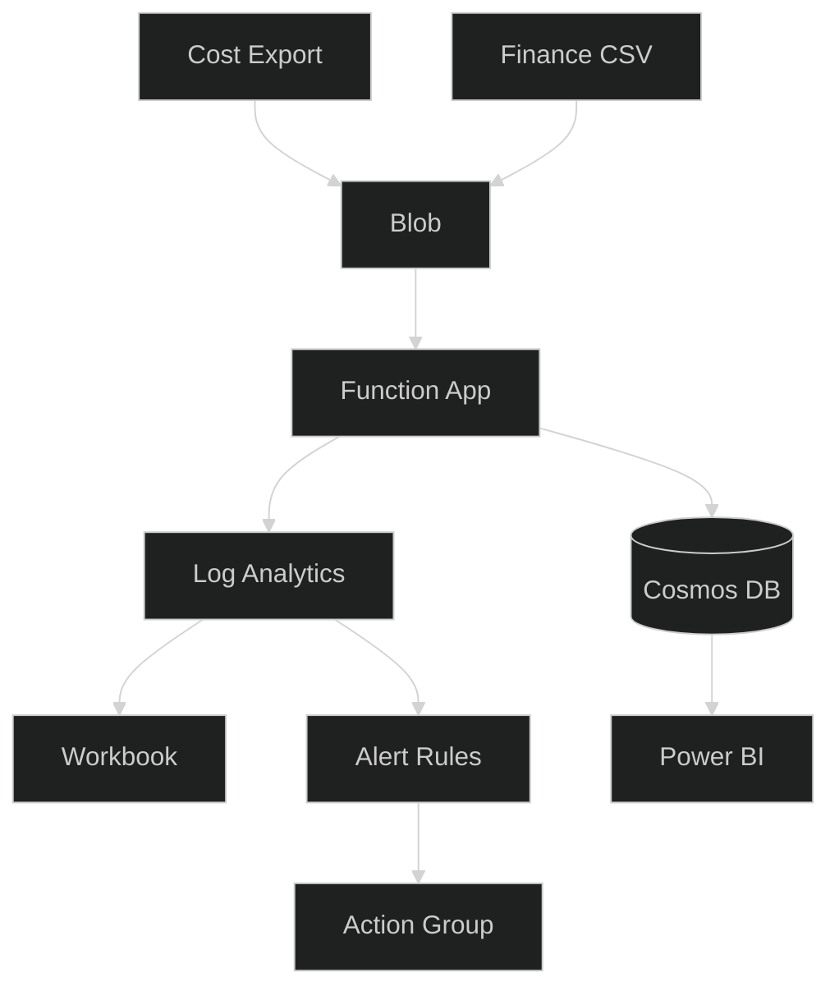

---

## Eraser.io — Enhanced Architecture Diagram

> Paste into [eraser.io](https://app.eraser.io/) → select **Cloud Architecture** diagram type.
> This is the enhanced version of the Mermaid diagram above — all 9 endpoints, workflow tags, and logic annotations.

```
// ═══════════════════════════════════════════════════════════════
// FinOps Budget Alert Automation — Full Architecture
// Amortized Cost Monitoring · 9 Endpoints
// ═══════════════════════════════════════════════════════════════

// ──────────────────────────────────────────
// STAGE 1 · DATA SOURCES
// Cost Management runs at 03:00 UTC daily,
// exports amortized costs (RI/SP spread) to Blob.
// Finance team uploads approved budgets as CSV.
// Event Grid fires on every new RG creation.
// ──────────────────────────────────────────

Cost Management Export [icon: azure-cost-management, label: "Daily 03:00 UTC · AmortizedCost type · RI/SP costs spread across benefiting RGs"] {
  Amortized CSV [icon: file-text, label: "Pre-calculated by Azure · not raw billing"]
}

Finance CSV Upload [icon: upload-cloud, label: "Finance-approved budgets · uploaded to blob by finance team"] {
  Budget Spreadsheet [icon: file-spreadsheet, label: "RG-level EUR budgets"]
}

Event Grid [icon: azure-event-grid, label: "Subscription-level · fires on Microsoft.Resources/subscriptions/resourceGroups/write"]


// ──────────────────────────────────────────
// STAGE 2 · INGESTION + ORCHESTRATION
// Blob is the CSV landing zone.
// 3 Logic Apps orchestrate different write paths.
// ──────────────────────────────────────────

Blob Storage [icon: azure-blob-storage, label: "CSV landing zone · amortized-cost-exports/ + finance-budgets/"]

Auto-Budget Logic App [icon: azure-logic-apps, label: "Trigger: Event Grid · Action: POST /api/update-budget with EUR 100 default"] {
  Tag: auto-created [icon: tag, label: "Sets source=auto-budget on Cosmos doc"]
}

Budget Change Logic App [icon: azure-logic-apps, label: "Trigger: HTTP POST · Action: validates floor EUR 100 / cap 3x · calls /api/update-budget"] {
  Tag: self-service [icon: tag, label: "Users request budget changes · guardrails enforced"]
}

Backfill Logic App [icon: azure-logic-apps, label: "Trigger: Daily recurrence · Action: GET /api/backfill · catches untracked RGs"] {
  Tag: safety-net [icon: tag, label: "Ensures zero RGs slip through without a budget doc"]
}


// ──────────────────────────────────────────
// STAGE 3 · FUNCTION APP — WRITE PATH (7 of 9)
// Core engine. Each function persists to Cosmos DB,
// then calls _sync_to_law() to push full inventory
// to Log Analytics for dashboards + alerting.
// ──────────────────────────────────────────

Function App [icon: azure-function-apps, label: "func-finops-amortized · Python 3.11 · Linux Consumption · 9 endpoints"] {

  evaluate_amortized_budgets [icon: clock, label: "★ CORE AMORTIZED ENGINE · Timer 06:00 UTC daily · Reads amortized cost CSV from Blob · Calcs MTD spend per RG · Sets spend tier + compliance status · Writes Cosmos + syncs LAW"] {
    Tag: amortized-engine [icon: star, label: "The heart of the platform — handles RI/SP cost distribution across benefiting RGs"]
  }

  manual_evaluate [icon: play, label: "HTTP GET /api/evaluate · Same amortized evaluation logic as evaluate_amortized_budgets · On-demand for testing or ad-hoc runs"] {
    Tag: on-demand [icon: tag, label: "Calls same _run_evaluation() as the timer"]
  }

  backfill [icon: layers, label: "HTTP GET /api/backfill · Scans subscription for all RGs · Seeds Cosmos doc for every untracked RG · Checks Cosmos not Azure native budgets"] {
    Tag: discovery [icon: tag, label: "Ensures 100% RG coverage in inventory"]
  }

  update_budget [icon: edit-3, label: "HTTP POST /api/update-budget · Writes budget EUR amount · Enforces floor 100 / cap 3x original · Called by both Logic Apps"] {
    Tag: guardrails [icon: shield, label: "Floor EUR 100 · Cap 3x · prevents runaway budgets"]
  }

  ingest_finance [icon: upload, label: "Blob trigger on finance-budgets/ · Parses finance CSV · Upserts approved financeBudget per RG to Cosmos"] {
    Tag: finance-sync [icon: tag, label: "Bridges finance-approved vs technical budgets"]
  }

  quarterly_recalculate [icon: refresh-cw, label: "Timer quarterly (Jan/Apr/Jul/Oct 1st) · Adjusts all budgets from last quarter actuals + 10% buffer"] {
    Tag: quarterly-reset [icon: tag, label: "Prevents budget drift over time"]
  }

  manual_recalculate [icon: play, label: "HTTP GET /api/recalculate · Same quarterly recalculation logic as quarterly_recalculate · Triggered on-demand"] {
    Tag: on-demand [icon: tag, label: "Calls same recalc logic as the timer"]
  }
}


// ──────────────────────────────────────────
// STAGE 4 · DATA PERSISTENCE
// Cosmos DB = source of truth (69 RG docs).
// LAW = analytics layer (FinOpsInventory_CL).
// _sync_to_law() bridges the two after every write.
// ──────────────────────────────────────────

Cosmos DB [icon: azure-cosmos-db, label: "Source of truth · Database: finops · Container: inventory · Partition: subscriptionId · 69 RG documents"] {
  Tag: single-source [icon: database, label: "Budget + spend + compliance + contacts per RG"]
}

Log Analytics Workspace [icon: azure-log-analytics, label: "law-finops-budget · Table: FinOpsInventory_CL · Synced after every write via _sync_to_law()"] {
  Tag: analytics-layer [icon: search, label: "Powers Workbook queries + Scheduled Query Rules"]
}


// ──────────────────────────────────────────
// STAGE 5 · READ PATH (2 of 9) + EXTERNAL
// inventory + variance are read-only endpoints
// that query Cosmos directly (no LAW sync needed).
// Power BI connects to Cosmos for leadership reports.
// ──────────────────────────────────────────

Read APIs [icon: eye, label: "Read-only endpoints · query Cosmos directly · no write / no LAW sync"] {

  inventory [icon: list, label: "HTTP GET /api/inventory · Returns all 69 RG budget documents as JSON · Used by dashboards and automation"] {
    Tag: read-only [icon: tag, label: "No Cosmos write · no LAW sync"]
  }

  variance [icon: bar-chart-2, label: "HTTP GET /api/variance · Finance budget vs technical budget comparison per RG · Highlights mismatches"] {
    Tag: read-only [icon: tag, label: "No Cosmos write · no LAW sync"]
  }
}

Power BI [icon: power-bi, label: "External reporting for leadership · Connects to Cosmos DB directly · Semantic model over inventory container"]


// ──────────────────────────────────────────
// STAGE 6 · DASHBOARDS + ALERTING
// Workbook reads LAW for portal dashboards.
// 3 Scheduled Query Rules evaluate hourly.
// Action Group routes alerts to 2 email addresses.
// ──────────────────────────────────────────

Azure Workbook [icon: azure-workbooks, label: "FinOps Budget & Cost Governance · Pie chart (on_track/warning/over_budget) · Color-coded inventory grid · Bar charts"]

Scheduled Query Rules [icon: azure-monitor, label: "3 alert rules · evaluate FinOpsInventory_CL hourly"] {
  HeadUp Alert [icon: bell, label: "Sev 3 · Fires at 60% of budget · early warning"]
  Warning Alert [icon: alert-triangle, label: "Sev 2 · Fires at 80% of budget · action needed"]
  Critical Alert [icon: alert-octagon, label: "Sev 1 · Fires at 95% of budget · immediate escalation"]
}

Action Group [icon: azure-action-groups, label: "ag-finops-budget-alerts · Email: configured via finopsEmail parameter"]


// ──────────────────────────────────────────
// OPEN QUESTION
// ──────────────────────────────────────────

ITSM ServiceNow [icon: help-circle, label: "ITSM ticket creation · ServiceNow integration · pending decision"]


// ═══════════════════════════════════════════
// CONNECTIONS — Data Flow
// ═══════════════════════════════════════════

// Stage 1 → Stage 2: Data arrives
Cost Management Export > Blob Storage: Amortized CSV daily 03:00 UTC
Finance CSV Upload > Blob Storage: Finance-approved budgets on upload
Event Grid > Auto-Budget Logic App: New RG detected

// Stage 2 → Stage 3: Orchestration triggers functions
Auto-Budget Logic App > update_budget: POST EUR 100 default budget
Budget Change Logic App > update_budget: POST user-requested amount
Backfill Logic App > backfill: GET with subscriptionId + dryRun=false
Blob Storage > evaluate_amortized_budgets: CSV ready → amortized engine reads at 06:00
Blob Storage > ingest_finance: Blob trigger on finance-budgets/

// Stage 3 → Stage 4: All 7 write functions persist + sync
evaluate_amortized_budgets > Cosmos DB: Upsert MTD spend + tier + compliance
manual_evaluate > Cosmos DB: Same as evaluate_amortized_budgets
backfill > Cosmos DB: Seed new RG documents
update_budget > Cosmos DB: Upsert budget amount
ingest_finance > Cosmos DB: Upsert finance budget
quarterly_recalculate > Cosmos DB: Adjust all budgets quarterly
manual_recalculate > Cosmos DB: Same as quarterly_recalculate
Cosmos DB > Log Analytics Workspace: _sync_to_law() after every write

// Stage 4 → Stage 5: Read path
Cosmos DB > inventory: Query all docs
Cosmos DB > variance: Query finance vs technical
Cosmos DB > Power BI: Direct connector

// Stage 4 → Stage 6: Dashboards + Alerting
Log Analytics Workspace > Azure Workbook: KQL queries for tiles
Log Analytics Workspace > Scheduled Query Rules: Hourly evaluation
Scheduled Query Rules > Action Group: Threshold breached → notify
```

### Workflow Logic Summary (for the Eraser diagram)

| Stage | What happens | When | Key logic |
|-------|-------------|------|-----------|
| 1. Data Sources | Azure exports amortized costs; finance uploads budgets; Event Grid detects new RGs | 03:00 UTC daily / on-event | Amortized = RI/SP costs spread daily, not lump-sum |
| 2. Orchestration | Blob stores CSVs; 3 Logic Apps trigger the right function | On arrival / daily / on-event | Auto-Budget: EUR 100 default · Budget Change: floor/cap · Backfill: safety net |
| 3. Write Path | 7 functions process data → Cosmos → LAW | 06:00 UTC / on-demand / quarterly | `evaluate_amortized_budgets` is the ★ core — calcs MTD, sets tiers, drives alerts |
| 4. Persistence | Cosmos = truth, LAW = analytics | After every write | `_sync_to_law()` bridges the two — called by all 7 write functions |
| 5. Read Path | 2 read APIs + Power BI query Cosmos directly | On HTTP request | No writes, no LAW sync — pure reads |
| 6. Alerting | 3 SQRs evaluate hourly → Action Group → email | Hourly | 60% HeadUp → 80% Warning → 95% Critical |

---

## What Each Component Does

| Component | Resource Type | Purpose |
|-----------|--------------|---------|
| **Resource Group** `rg-finops-budget-mvp` | Container | Holds all FinOps resources |
| **Action Group** `ag-finops-budget-alerts` | Monitor | Routes alerts to email (configured via `finopsEmail` parameter) |
| **Logic App** `la-finops-auto-budget` | Logic App | Auto-creates EUR 100 budget on new RGs (via Event Grid), includes Action Group for alerts |
| **Logic App** `la-finops-budget-change` | Logic App | Self-service: users POST to change their budget (floor EUR 100, cap 3x), syncs to Cosmos DB |
| **Logic App** `la-finops-backfill` | Logic App | Daily safety net — calls /api/backfill to catch RGs without budgets |
| **Storage Account** `safinops...` | Storage | Blob container for amortized cost export CSVs + finance CSVs |
| **Cosmos DB** `cosmos-finops-...` | NoSQL DB | FinOps Inventory — single source of truth for budgets, spend, compliance |
| **Function App** `func-finops-...` (9 endpoints) | Compute | FinOps Inventory Engine — daily evaluation + REST APIs + backfill + LAW sync |
| **Event Grid** `finops-rg-write-events` | Events | Detects new RG creation → triggers auto-budget Logic App |
| **Cost Export** `finops-daily-amortized` | Cost Mgmt | Daily AmortizedCost export to blob (active since March 2026) |
| **Log Analytics** `law-finops-budget` | Monitor | Stores FinOpsInventory_CL table for Workbook + Alert Rules |
| **Workbook** `FinOps Budget & Cost Governance` | Monitor | Live dashboard with pie chart, color-coded tables, bar charts |
| **Alert Rule** `finops-alert-headup` | Monitor | Sev 3 — fires when HeadUp threshold crossed (via Action Group) |
| **Alert Rule** `finops-alert-warning` | Monitor | Sev 2 — fires when Warning threshold crossed (via Action Group) |
| **Alert Rule** `finops-alert-critical` | Monitor | Sev 1 — fires when Critical threshold crossed (via Action Group) |
| **Subscription Budget** `finops-sub-budget-dev` | Consumption | Native Azure budget (EUR 5,000) with 5 threshold alerts |
| **Audit Policy** `finops-audit-rg-without-budget` | Policy | Flags RGs without a budget in the compliance dashboard |

---

## The Amortized Cost Problem & Solution

### Why Native Azure Budgets Don't Work for Amortized Cost Scenarios

Azure native budgets alert on **actual cost** only.

**Actual cost** — 3-year Reserved Instance at EUR 36K:

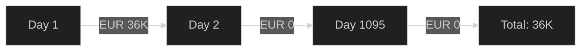

**Amortized cost** — same RI, spread daily:

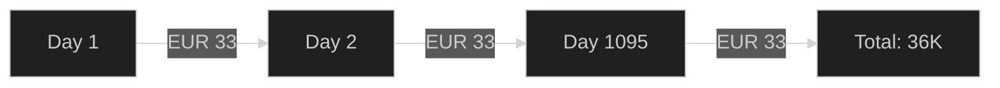

Organizations with heavy RI/Savings Plan usage find native budget alerts fire on Day 1 of purchase then never again — making them useless for ongoing cost monitoring.

### Our Solution

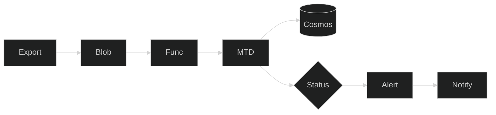

**Key insight:** We don't calculate amortized cost ourselves. Azure Cost Management Export (type: amortized) does it automatically — distributing RI/SP costs across benefiting RGs. Alert thresholds are **not fixed** — they scale by spend tier (see Budget Alert Notification Framework below).

---

## Cosmos DB — FinOps Inventory Schema

Each document = one resource group. Partition key = `subscriptionId`.

```json
{
  "id": "sub-id_rg-name",
  "subscriptionId": "<YOUR_SUBSCRIPTION_ID>",
  "resourceGroup": "rg-imaging-prod",
  "technicalBudget": 15000,          // from 3-month avg + 10%
  "financeBudget": 18000,            // from finance department
  "amortizedMTD": 16200,             // updated daily by Function
  "forecastEOM": 19440,              // burn rate extrapolation
  "burnRateDaily": 623,              // amortizedMTD / day_of_month
  "actualPct": 108,                  // amortizedMTD / budget * 100
  "forecastPct": 129.6,              // forecast / budget * 100
  "complianceStatus": "over_budget", // on_track | warning | over_budget
  "ownerEmail": "imaging-lead@example.com",
  "technicalContact1": "infra-eng1@example.com",
  "technicalContact2": "infra-eng2@example.com",
  "billingContact": "billing-imaging@example.com",
  "costCenter": "BU-Imaging",
  "spendTier": "5K-10K",             // $0-1K | $1K-5K | $5K-10K | $10K+
  "governanceTag": "<GOVERNANCE_TAG_VALUE>",  // triggers governance alert if configured value
  "lastEvaluated": "2026-03-26T06:00:00Z"
}
```

---

## How Budgets Get Set

### For Existing RGs (8,000+)

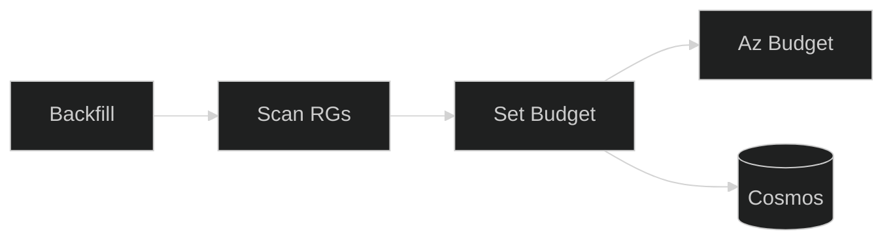

### For New RGs (auto-created)

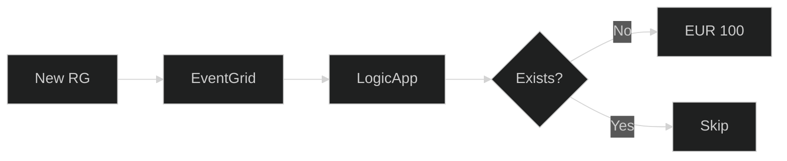

### Finance Budget (top-down)

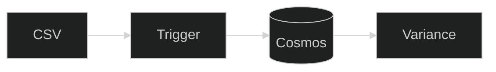

---

## Alert Flow

The Function App evaluates each RG daily, classifies its spend tier from the 3-month average, and dispatches tiered alerts with tag-based recipients.

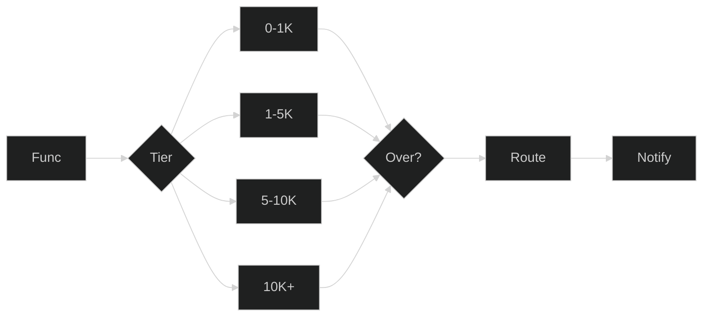

See **Budget Alert Notification Framework** below for the full threshold matrix.

**Required RG tags for alert routing:**

| Tag Key | Example Value | Used At |
|---------|--------------|--------|
| `Owner` | `imaging-lead@example.com` | Warning+, budget change access control |
| `TechnicalContact1` | `infra-eng1@example.com` | All alert levels (HeadUp+) |
| `TechnicalContact2` | `infra-eng2@example.com` | All alert levels (HeadUp+) |
| `BillingContact` | `billing-imaging@example.com` | Warning + Critical alerts |
| `CostCenter` | `BU-Imaging` | Spend grouping in dashboards |
| `GovernanceTag` | `<GOVERNANCE_TAG_VALUE>` | Governance alert trigger |

---

## Budget Alert Notification Framework

Thresholds are **not fixed** — they scale by the RG's 3-month average spend. Smaller RGs tolerate higher variance; larger RGs get tighter controls. Each tier has three severity levels with escalating recipients.

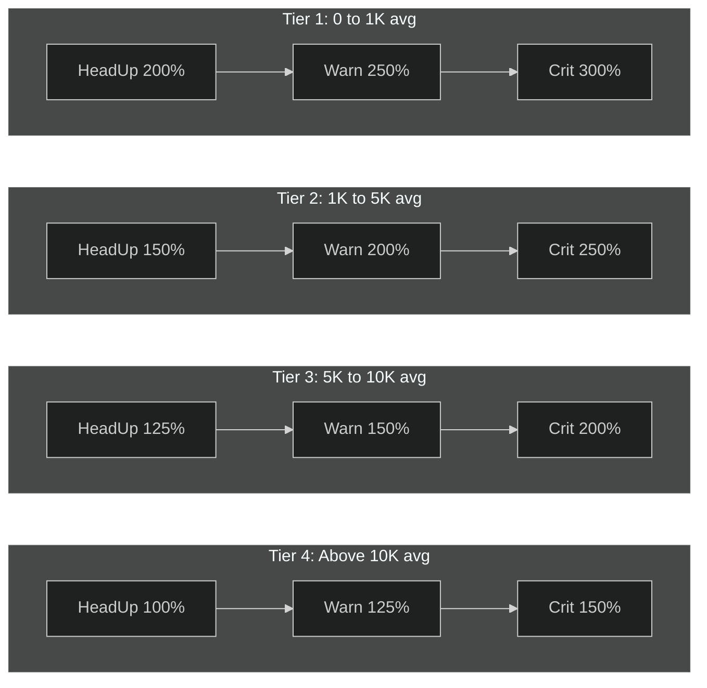

### Threshold Matrix

| Spend Tier (3-mo avg) | HeadUp | Warning | Critical |
|----------------------|--------|---------|----------|
| **$0 – $1K** | 200% | 250% | 300% |
| **$1K – $5K** | 150% | 200% | 250% |
| **$5K – $10K** | 125% | 150% | 200% |
| **Above $10K** | 100% | 125% | 150% |

### Recipient Escalation

| Severity | Recipients |
|----------|------------|
| **HeadUp** | Owner, TechnicalContact1, TechnicalContact2 |
| **Warning** | Owner, TechnicalContact1, TechnicalContact2, BillingContact |
| **Critical** | Owner, TechnicalContact1, TechnicalContact2, BillingContact, Governance |

### Governance Tag Special Alert

Any RG/Subscription/Account with tag `GovernanceTag` = **configured governance value** triggers an immediate Governance notification:
- New RG created with `GovernanceTag = <GOVERNANCE_TAG_VALUE>` → notify Governance
- Existing RG where `GovernanceTag` changes to the configured value → notify Governance

### Alert Email Template

```
Dear [Owner],

As part of our ongoing commitment to transparency and effective cloud cost
management, we wanted to provide you with an update on your cloud spend
for [Month].

Current Cloud Expenditure: [Amount Spent]

As of [Date], your total cloud expenditure for [Month] is [Amount Spent].
You have crossed [Percentage]% of last 3-month average spend.

Resource Group: [RG Name]
Spend Tier:     [Tier]
Alert Level:    [HeadUp / Warning / Critical]
```

| Variable | Source |
|----------|--------|
| `[Owner]` | RG tag: `Owner` |
| `[Month]` | Current calendar month |
| `[Amount Spent]` | Cosmos DB: `amortizedMTD` |
| `[Date]` | Evaluation date |
| `[Percentage]` | Cosmos DB: `actualPct` |
| `[RG Name]` | Cosmos DB: `resourceGroup` |
| `[Tier]` | Cosmos DB: `spendTier` |

---

## Dashboard & API

| Endpoint | URL | Returns |
|----------|-----|---------|
| Full inventory | `/api/inventory` | All RGs with budgets, spend, status |
| Filter by status | `/api/inventory?status=over_budget` | Only over-budget RGs |
| Finance variance | `/api/variance` | Finance vs Technical budget comparison |
| Manual evaluation | `/api/evaluate` | Triggers daily evaluation on-demand |
| Manual recalc | `/api/recalculate` | Quarterly budget recalculation |
| Update budget | `/api/update-budget` | Update technicalBudget in Cosmos DB (called by Logic App) |
| Backfill | `/api/backfill?subscriptionId=...&dryRun=true` | Scan + create budgets for existing RGs |

**Dashboard options:**
- **Azure Workbook** (deployed) — `FinOps Budget & Cost Governance` with pie chart, color-coded inventory table, bar chart. Queries `FinOpsInventory_CL` in Log Analytics.
- **Power BI** — connect to Cosmos DB directly or via `/api/inventory` (templates in `powerbi/`)
- **Cosmos DB Data Explorer** — run SQL queries directly (examples in `queries/`)

**Dashboard views (required by iteration 01):**

| View | Description | Data Source |
|------|-------------|-------------|
| Spend vs Budget | Side-by-side amortized spend against technical and finance budget per RG | Cosmos DB: `amortizedMTD` vs `technicalBudget` |
| Over-budget resources | RGs where `complianceStatus = over_budget` | `/api/inventory?status=over_budget` |
| Under-utilised budgets | RGs where spend is < 30% of budget (budget set too high) | Cosmos DB: `actualPct < 30` |
| Business unit performance | Spend grouped by `costCenter` tag across RGs | Cosmos DB: group by `costCenter` |
| Spend grouping | Aggregate spend by cost center, subscription, or business unit | `/api/inventory` + Power BI grouping on `costCenter` field |

---

## Scripts Reference

| Script | Purpose | When to Run |
|--------|---------|-------------|
| `Invoke-BudgetBackfill.ps1` | Create budgets for all existing RGs | Initial rollout + quarterly |
| `Initialize-BudgetTable.ps1` | Seed Cosmos DB from existing Azure budgets | After backfill |
| `Set-FinanceBudget.ps1` | Load finance department budget targets | When finance provides CSV |
| `New-AmortizedExport.ps1` | Create daily amortized cost export | Once (starts data flow) |
| `Invoke-QuarterlyRecalc.ps1` | Re-adjust budgets from last quarter's actuals | Quarterly |
| `Enable-AdminFeatures.ps1` | Assign RBAC + deploy policy (needs Owner) | Once per subscription |
| `Seed-CosmosDemo.ps1` | Insert demo data for testing | Development only |

---

## Key Decisions

| Decision | Rationale |
|----------|-----------|
| **Cosmos DB over Table Storage** | Rich queries, Power BI connector, change feed, serverless |
| **Custom Function over native budgets** | Native budgets = actual cost only. Amortized cost monitoring requires custom solution |
| **EUR 100 default budget** | Eliminates noise from micro-RGs (EUR 5, EUR 20) |
| **Tiered alert thresholds** | Low-spend RGs ($0–$1K) alert at 200%+; high-spend ($10K+) alert at 100% — reduces noise, focuses on material risk |
| **Event Grid + Logic App over Policy** | Azure Policy can't create budgets (not ARM-native) |
| **3-month rolling average** | Stable baseline, smooths seasonal variation |
| **10% buffer on budget** | Prevents false alerts from normal spend fluctuation |
| **Finance + Technical dual budget** | Exec view: finance expectation vs reality |

---

## RBAC Assignments (Live)

### Function App Managed Identity

The Function App MI (`<YOUR_FUNCTION_APP>`) has 5 role assignments:

| Role | Scope | Purpose |
|------|-------|---------|
| **Storage Blob Data Owner** | Storage Account | Read cost export CSVs, write finance CSVs |
| **Storage Queue Data Contributor** | Storage Account | Function runtime queue processing |
| **Storage Table Data Contributor** | Storage Account | Function runtime table access |
| **Reader** | Subscription | List resource groups for backfill endpoint |
| **Cost Management Contributor** | Subscription | Create/update Azure budgets on RGs |

### Logic App Managed Identities

| Logic App | Role | Scope | Purpose |
|-----------|------|-------|---------|
| `la-finops-auto-budget` | Cost Management Contributor | Subscription | Create budgets on new RGs |
| `la-finops-auto-budget` | Reader | Subscription | Check existing budgets before creating |

### Auto-Created Budgets Include Action Group

When the auto-budget Logic App or the backfill function creates a budget on an RG, the budget includes the Action Group (`ag-finops-budget-alerts`) in its notification configuration — so alerts route to email from day one.

---

## Log Analytics — FinOpsInventory_CL

The Function App syncs Cosmos DB inventory to Log Analytics after every daily evaluation and manual `/api/evaluate` call.

**Table:** `FinOpsInventory_CL` in `law-finops-budget`

**Data flow:** Cosmos DB → Function App `_sync_inventory_to_law()` → Data Collector API → LAW → Workbook KQL queries + Scheduled Query Rules

**Key columns:** `ResourceGroup`, `technicalBudget_d`, `financeBudget_d`, `amortizedMTD_d`, `forecastEOM_d`, `actualPct_d`, `forecastPct_d`, `burnRateDaily_d`, `complianceStatus_s`, `costCenter_s`, `ownerEmail_s`, `spendTier_s`

**Workbook queries** use `arg_max(TimeGenerated, *)` grouped by `ResourceGroup` to always show the latest sync batch.

**Ingestion latency:** Data Collector API returns HTTP 200 immediately; ingestion takes 5–20 minutes.

---

## Alerting Architecture

Amortized cost alerts use Azure Monitor Scheduled Query Rules that query LAW hourly and fire through the Action Group.

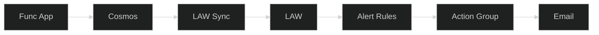

| Alert Rule | Severity | Condition | Fires When |
|-----------|----------|-----------|------------|
| `finops-alert-headup` | Sev 3 (Info) | `complianceStatus_s == 'at_risk'` | HeadUp threshold crossed |
| `finops-alert-warning` | Sev 2 (Warning) | `complianceStatus_s == 'warning'` | Warning threshold crossed |
| `finops-alert-critical` | Sev 1 (Error) | `complianceStatus_s == 'over_budget'` | Critical threshold crossed |

**Action Group:** `ag-finops-budget-alerts` → configured via `finopsEmail` parameter

**Evaluation frequency:** Every 1 hour. Queries the latest sync batch in LAW.

---

## Finance Budget Ingestion (Live)

Finance drops CSV into blob → Function auto-ingests to Cosmos DB. **Zero manual steps.**

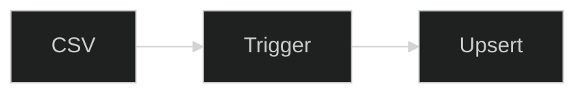

**Active: Option A (Blob Trigger)** — Finance drops CSV into `finance-budgets/` container. Function `ingest_finance_budget` auto-parses and upserts to Cosmos DB. Tested and confirmed live.

---

## CI/CD & Scaling Vision

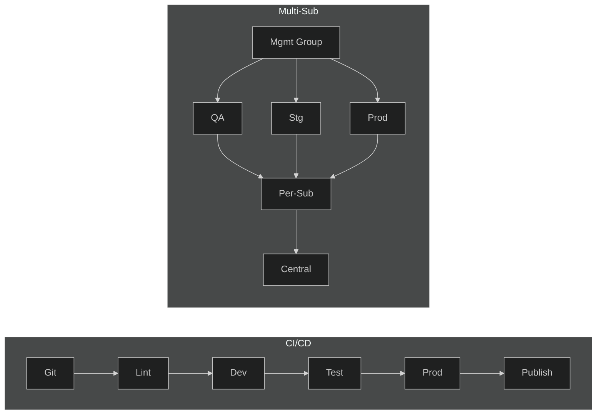

**Centralized vs Per-Subscription:**
- **Centralized (one instance):** Cosmos DB, Function App, Dashboard, Action Group — shared across all subscriptions
- **Per-subscription (replicated):** Azure Budgets, Policy Assignment, Event Grid, Cost Export — deployed to each subscription via pipeline parameter matrix

---

## ITSM Catalogue Integration (ServiceNow)

Your organization may use a ServiceNow-based IT Service Management (ITSM) platform for resource group provisioning, CMDB tracking, and change management. The FinOps platform can integrate with your ITSM for budget lifecycle management.

### Current State vs Target

| Capability | Current (Azure-native) | Target (ITSM-integrated) |
|------------|----------------------|---------------------------|
| Budget set during RG creation | Event Grid → auto EUR 100 | ITSM form captures user-defined budget → syncs to Azure + Cosmos DB |
| Budget change request | Logic App HTTP POST (JSON) | ITSM Catalogue form → approval workflow → calls Logic App |
| Budget visibility in CMDB | Not synced | Cosmos DB budget data reflected in ITSM CMDB |
| Block portal budget changes | Not enforced | Azure Policy deny on manual `Microsoft.Consumption/budgets` writes |

### Integration Architecture — Two Options

**Option A: ITSM reads from us (recommended for MVP)**

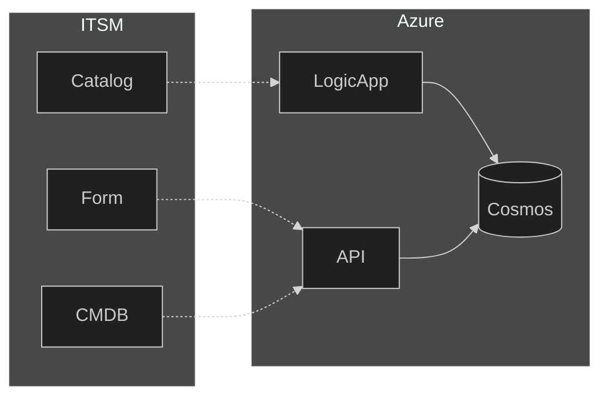

**How it works:**
1. ITSM RG creation form includes a mandatory **"Monthly Budget"** field
2. On form submission, the ITSM workflow calls `/api/update-budget` with the user-defined budget amount
3. For budget change requests, ITSM Catalogue form collects justification → runs approval → calls `la-finops-budget-change` HTTP trigger
4. ITSM CMDB periodically polls `/api/inventory` to sync current budget + spend data for display in ServiceNow dashboards

**Prerequisites:** ITSM must be able to make outbound HTTPS calls to the Azure Function App endpoint.

**Option B: We push to ITSM (event-driven)**

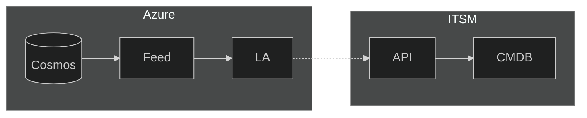

**How it works:**
1. Cosmos DB Change Feed detects any budget update (new budget, change, daily evaluation)
2. Logic App fires and pushes the updated record to ITSM via ServiceNow Table API or a custom ITSM REST endpoint
3. CMDB stays in sync automatically — no polling required

**Prerequisites:** ITSM must expose a REST API endpoint, and the Logic App needs ServiceNow credentials (OAuth or Basic Auth via Key Vault).

### Governance Tag — ITSM Handshake

When the ITSM creates or modifies an RG with `GovernanceTag = <GOVERNANCE_TAG_VALUE>`, the platform must send an immediate governance notification regardless of spend level. This works in both integration options:
- **Option A:** ITSM includes `governanceTag` in the `/api/update-budget` payload → Function App triggers governance alert
- **Option B:** Change Feed detects `governanceTag` update → Logic App notifies Governance + syncs to ITSM

### ITSM Catalogue Requirements

| # | Requirement | ITSM Team Action | Azure Side |
|---|------------|-------------------|------------|
| 1 | Add mandatory **"Monthly Budget"** field to RG creation form | Modify ITSM Catalogue form | Expose `/api/update-budget` (done) |
| 2 | Budget sync for existing 8,000+ RGs | Add Monthly Budget field to CMDB records | Provide initial data dump via `/api/inventory` |
| 3 | Budget change request form | Build Catalogue form with: RG dropdown, current budget (read-only), requested budget, justification | Accept POST on `la-finops-budget-change` (done) |
| 4 | Approval workflow for large changes | Configure ServiceNow approval rules (e.g. > 3x current budget) | Logic App already enforces floor EUR 100 + cap 3x |
| 5 | Ongoing CMDB sync | Option A: Poll `/api/inventory` on schedule, or Option B: Accept push webhook | Either expose API (done) or deploy Change Feed Logic App |

### API Contract for ITSM Integration

**Budget creation / update** — `POST /api/update-budget`

```json
{
  "subscriptionId": "<YOUR_SUBSCRIPTION_ID>",
  "resourceGroupName": "rg-imaging-prod",
  "newBudgetAmount": 15000,
  "requestorEmail": "rg-owner@example.com",
  "reason": "New RG created via ITSM"
}
```

Response: `{ "status": "cosmos_updated", "oldBudget": 0, "newBudget": 15000 }`

**Budget change with validation** — `POST` to `la-finops-budget-change` HTTP trigger URL

```json
{
  "subscriptionId": "<YOUR_SUBSCRIPTION_ID>",
  "resourceGroupName": "rg-imaging-prod",
  "newBudgetAmount": 20000,
  "requestorEmail": "rg-owner@example.com",
  "reason": "Approved via ITSM ticket INC00123456"
}
```

Validation chain: Owner tag check → Floor EUR 100 → Cap 3x → Update Azure Budget → Update Cosmos DB → Notify Teams

**Read inventory** — `GET /api/inventory?subscriptionId=...`

Returns array of all RG budget documents — ITSM can consume this to populate CMDB fields.

---

## Budget Change Governance

### Block Manual Budget Changes from Azure Portal

To enforce that all budget changes go through the ITSM (or the Logic App), deploy an Azure Policy **deny** rule that blocks direct writes to `Microsoft.Consumption/budgets` unless the caller is a managed identity (Function App or Logic App).

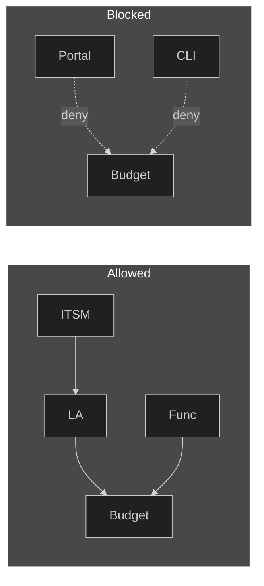

**Policy definition (conceptual):**
- **Effect:** Deny
- **Condition:** `Microsoft.Consumption/budgets` write operations where the caller principal is NOT in the allowed list (Function App MI, Logic App MIs)
- **Scope:** Subscription or Management Group
- **Exemptions:** Managed identities of `func-finops-amortized-*`, `la-finops-auto-budget`, `la-finops-budget-change`, `la-finops-backfill`

> **Note:** This addresses the stakeholder requirement: *"We shd not allow change of budget from portal."* All budget modifications must flow through ITSM → Logic App → Azure, providing a full audit trail.

### Approval Workflow for Large Budget Changes

For budget increases beyond the 3x cap or exceeding a configurable threshold, an approval gate is required before the change takes effect.

| Change Size | Flow |
|------------|------|
| Within floor–cap range (EUR 100 to 3x current) | Auto-approved → Logic App executes immediately |
| Exceeds 3x cap | Requires approval → ITSM routes to FinOps manager → on approval, ITSM calls Logic App with override flag |
| New budget > EUR 50,000 | Requires CFO/BU-head approval in ITSM before execution |

**Where approval lives:**
- **If ITSM is available:** Approval workflow runs in ServiceNow. The Logic App only executes after ITSM confirms approval.
- **If ITSM is not yet integrated:** The Logic App rejects changes > 3x with a 400 response. Manual override via `/api/update-budget` with admin key.

---

## ITSM-to-Azure Integration — Proposed Solutions

The core challenge: when someone fills the ITSM Catalogue form (ServiceNow) and sets a budget, that value must automatically reach Azure Cosmos DB and the native Azure Budget on the RG. Below are four concrete approaches.

### Solution 1: ServiceNow Outbound REST (Recommended)

ITSM workflow calls our Azure Function App directly via HTTPS.


**How:** ServiceNow REST Message + HTTP Action in the catalogue workflow. On form submission, POST to `https://func-finops-....azurewebsites.net/api/update-budget?code=<key>` with subscription ID, RG name, budget amount.

**Pros:** Simple, real-time, no middleware. Azure side already built (`/api/update-budget` is live).

**Cons:** Requires outbound HTTPS from ITSM to Azure (firewall rule). Function App key must be stored in ServiceNow as a credential.

### Solution 2: Azure Integration Account + ServiceNow Connector

Use Azure Logic App with the built-in ServiceNow connector to poll or receive events.


**How:** Logic App uses the ServiceNow connector to poll a custom table (e.g. `u_finops_budget_requests`) every 5 minutes. New records trigger the budget update flow.

**Pros:** No outbound from ITSM needed. Logic App pulls from SNOW. Native Azure connector.

**Cons:** 5-minute polling delay. Requires ServiceNow connector license. Needs a custom SNOW table.

### Solution 3: Shared Middleware (Azure Service Bus)

ITSM drops a message to Azure Service Bus; Logic App picks it up.


**How:** ITSM posts a JSON message to a Service Bus queue via REST. A Logic App trigger picks up the message and calls `/api/update-budget`.

**Pros:** Decoupled, reliable (queue guarantees delivery), works across network boundaries.

**Cons:** Extra component (Service Bus). More moving parts.

### Solution 4: MID Server + Azure Blob Drop

ITSM exports budget data to a CSV via MID Server; Function App picks it up via blob trigger (same as finance ingestion).


**How:** ServiceNow MID Server (already deployed in the organization's network) writes a CSV to the Azure Storage blob container. The existing blob trigger function picks it up and upserts to Cosmos DB.

**Pros:** Reuses existing finance ingestion pipeline. MID Server handles network connectivity. No new firewall rules.

**Cons:** Batch (not real-time). Depends on MID Server availability.

### Comparison

| Solution | Real-time | Complexity | Network | Prerequisites |
|----------|-----------|-----------|---------|---------------|
| 1. Outbound REST | Yes | Low | ITSM → Azure HTTPS | Needs firewall rule |
| 2. SNOW Connector | Near (5 min) | Medium | Azure → ITSM | Needs connector license |
| 3. Service Bus | Yes | Medium | ITSM → Service Bus | Needs queue setup |
| 4. MID Server + Blob | Batch | Low | MID → Blob (internal) | MID Server exists |

**Recommendation:** Start with **Solution 1** (outbound REST) if firewall allows. Fall back to **Solution 4** (MID Server + Blob) if outbound HTTPS from ITSM is blocked.

---

## Iteration 01 Alignment Checklist

| # | Requirement (iteration_01.md) | Status | Implementation |
|---|------------------------------|--------|----------------|
| 1 | Every RG has a budget | ✅ Done | Backfill + Event Grid auto-budget |
| 2 | Subscription-level budget | ✅ Done | Native budget EUR 5,000 |
| 3 | Amortized cost tracking | ✅ Done | Cost Export → Function App → Cosmos DB |
| 4 | 3-month avg for existing RGs | ✅ Done | Backfill calculates avg + 10% |
| 5 | Default $100 for new RGs | ✅ Done | Event Grid → Logic App EUR 100 |
| 6 | Tag-based alert routing | 🔧 Enhancement | Read RG tags at eval time, route by severity level |
| 6a | Tiered thresholds by spend bracket | 🔧 Enhancement | 4 tiers: $0–1K (200/250/300%), $1K–5K, $5K–10K, $10K+ (100/125/150%) |
| 6b | Governance tag alert | 🔧 Enhancement | Notify Governance when GovernanceTag = configured value |
| 7 | Spend grouping by BU | 🔧 Enhancement | Group by `costCenter` in dashboards |
| 8 | Under-utilised budget view | 🔧 Enhancement | Filter `actualPct < 30` in Workbook + Power BI |
| 9 | Self-service budget change | ✅ Done | `la-finops-budget-change` with floor/cap |
| 10 | ITSM budget field in RG form | 📋 Planned | ITSM team adds field → calls `/api/update-budget` |
| 11 | ITSM CMDB sync | 📋 Planned | Option A (poll) or Option B (push via Change Feed) |
| 12 | ITSM change request form | 📋 Planned | ITSM Catalogue form → calls Logic App |
| 13 | Block portal budget changes | 📋 Planned | Azure Policy deny rule (non-MI callers) |
| 14 | Approval for large changes | 📋 Planned | ITSM approval workflow or Logic App gate |
| 15 | Spend vs Budget dashboard | ✅ Done | Workbook + Power BI |
| 16 | Finance budget ingestion | ✅ Done | Blob trigger auto-ingestion |

---

*Azure Amortized Cost Management. 17 deployed resources, 9 Function App endpoints, tiered notification framework, LAW-based workbook, 3 Scheduled Query Rules.*
