# Technical Guide — Azure Amortized Cost Management

> How the platform works, what each component does, and how they connect.

---

## Full Ecosystem

> Single source of truth — rendered from [ecosystem-diagram.svg](ecosystem-diagram.svg)


**9 Function App endpoints · 6 stages · all write paths persist to Cosmos DB then sync to LAW via `_sync_to_law()`**

### How It Works — End-to-End Flow

1. **Cost Management Export** writes amortized cost CSVs to Blob Storage daily at **03:00 UTC**. If no export exists, the Function App falls back to the **Cost Management Query API** for immediate cost data.
2. At **06:00 UTC**, `evaluate_amortized_budgets` (the core amortized engine) reads cost data and calculates **month-to-date spend per RG**
3. Each RG gets a **spend tier** ($0–1K / $1K–5K / $5K–10K / $10K+), **compliance status**, and **threshold check**
4. All 7 write functions persist to **Cosmos DB** (source of truth), then call `_sync_to_law()` which pushes the full inventory to **Log Analytics** via DCR (Managed Identity)
5. **3 Scheduled Query Rules** evaluate LAW hourly — firing at **60% (HeadUp)**, **80% (Warning)**, **95% (Critical)**
6. **Action Group** routes alerts to the FinOps team via email
7. **Azure Workbook** reads LAW for real-time portal dashboards; **Power BI** reads Cosmos for leadership reports

### Function App Endpoints — All 9

| # | Function | Trigger | Route | What it does |
|---|----------|---------|-------|-------------|
| 1 | `evaluate_amortized_budgets` | Timer (daily 06:00 UTC) | — | **Core amortized engine** — reads amortized cost data, calcs MTD per RG, sets spend tier + compliance, syncs to LAW |
| 2 | `manual_evaluate` | HTTP GET | `/api/evaluate` | Same amortized evaluation logic as #1 — triggered on-demand for testing or ad-hoc runs |
| 3 | `backfill_existing_rgs` | HTTP GET | `/api/backfill` | Scans subscription for all RGs, seeds a Cosmos doc for every untracked RG |
| 4 | `update_budget` | HTTP POST | `/api/update-budget` | Writes budget amount, enforces floor/cap guardrails, syncs to LAW |
| 5 | `ingest_finance_budget` | Blob trigger | `finance-budgets/{name}` | Parses finance CSV on upload, upserts approved financeBudget per RG to Cosmos |
| 6 | `quarterly_recalculate` | Timer (quarterly Jan/Apr/Jul/Oct) | — | Adjusts all budgets based on last quarter's actual spend + 10% buffer |
| 7 | `manual_recalculate` | HTTP GET | `/api/recalculate` | Same quarterly recalculation logic as #6 — triggered on-demand |
| 8 | `get_inventory` | HTTP GET | `/api/inventory` | Returns all RG budget documents as JSON for dashboards and reporting |
| 9 | `get_variance` | HTTP GET | `/api/variance` | Finance budget vs technical budget comparison per RG |
| — | `_sync_to_law()` | Internal helper | — | Called by all 7 write functions — reads Cosmos, pushes full inventory to LAW via DCR |

---

## Architecture at a Glance

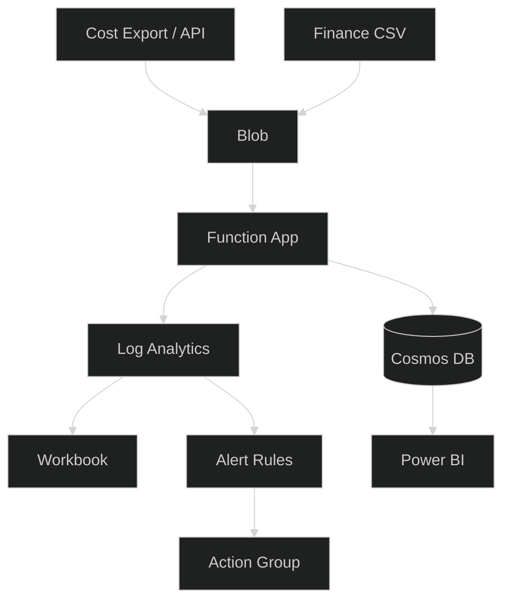

---

## Data Flow Summary

| Stage | What happens | When | Key logic |
|-------|-------------|------|-----------|
| 1. Data Sources | Azure exports amortized costs (or API fallback); finance uploads budgets; Event Grid detects new RGs | 03:00 UTC daily / on-event | Amortized = RI/SP costs spread daily, not lump-sum |
| 2. Orchestration | Blob stores CSVs; 3 Logic Apps trigger the right function | On arrival / daily / on-event | Auto-Budget: default budget · Budget Change: floor/cap · Backfill: safety net |
| 3. Write Path | 7 functions process data → Cosmos → LAW | 06:00 UTC / on-demand / quarterly | `evaluate_amortized_budgets` is the core — calcs MTD, sets tiers, drives alerts |
| 4. Persistence | Cosmos = truth, LAW = analytics | After every write | `_sync_to_law()` bridges the two via DCR (Managed Identity) |
| 5. Read Path | 2 read APIs + Power BI query Cosmos directly | On HTTP request | No writes, no LAW sync — pure reads |
| 6. Alerting | 3 SQRs evaluate hourly → Action Group → email | Hourly | 60% HeadUp → 80% Warning → 95% Critical |

---

## What Each Component Does

| Component | Resource Type | Purpose |
|-----------|--------------|---------|
| **Resource Group** | Container | Holds all FinOps resources |
| **Action Group** `ag-finops-budget-alerts` | Monitor | Routes alerts to email (configured via `finopsEmail` parameter) |
| **Logic App** `la-finops-auto-budget` | Logic App | Auto-creates default budget on new RGs (via Event Grid), includes Action Group for alerts |
| **Logic App** `la-finops-budget-change` | Logic App | Self-service: users POST to change their budget (floor/cap guardrails), syncs to Cosmos DB |
| **Logic App** `la-finops-backfill` | Logic App | Daily safety net — calls /api/backfill to catch RGs without budgets |
| **Storage Account** | Storage | Blob containers for amortized cost export CSVs, finance CSVs, and Function App packages |
| **Cosmos DB** | NoSQL DB | FinOps Inventory — single source of truth for budgets, spend, compliance |
| **Function App** (9 endpoints) | Compute | FinOps Inventory Engine — daily evaluation + REST APIs + backfill + LAW sync |
| **Event Grid** | Events | Detects new RG creation → triggers auto-budget Logic App |
| **Data Collection Rule** | Monitor | DCR + DCE for MI-authenticated log ingestion to LAW (no shared keys) |
| **Log Analytics** `law-finops-budget` | Monitor | Stores `FinOpsInventory_CL` table for Workbook + Alert Rules |
| **Workbook** | Monitor | Live dashboard with compliance pie chart, inventory table, top spenders, burn rate analysis |
| **Alert Rules** (3) | Monitor | HeadUp (Sev 3), Warning (Sev 2), Critical (Sev 1) — fire on compliance status changes |
| **Subscription Budget** | Consumption | Native Azure budget with 5 threshold alerts (50/75/90/100/110%) |
| **Audit Policy** | Policy | Flags RGs without an Azure budget in the compliance dashboard |

---

## The Amortized Cost Problem & Solution

### Why Native Azure Budgets Don't Work for Amortized Cost Scenarios

Azure native budgets alert on **actual cost** only.

**Actual cost** — 3-year Reserved Instance at EUR 36K:

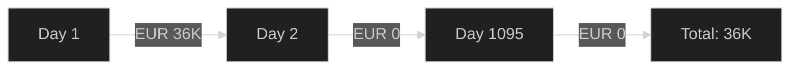

**Amortized cost** — same RI, spread daily:

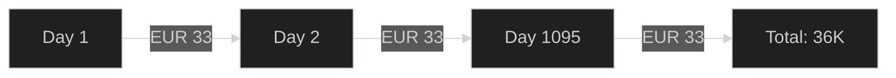

Organizations with heavy RI/Savings Plan usage find native budget alerts fire on Day 1 of purchase then never again — making them useless for ongoing cost monitoring.

### Our Solution

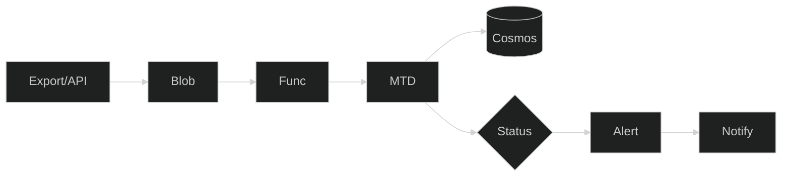

**Key insight:** We don't calculate amortized cost ourselves. Azure Cost Management (export or API, type: AmortizedCost) does it automatically — distributing RI/SP costs across benefiting RGs. Alert thresholds are **not fixed** — they scale by spend tier (see Budget Alert Notification Framework below).

---

## Cosmos DB — FinOps Inventory Schema

Each document = one resource group. Partition key = `subscriptionId`.

```json
{
  "id": "sub-id_rg-name",
  "subscriptionId": "<subscription-id>",
  "resourceGroup": "rg-workload-prod",
  "technicalBudget": 15000,
  "financeBudget": 18000,
  "amortizedMTD": 16200,
  "forecastEOM": 19440,
  "burnRateDaily": 623,
  "actualPct": 108,
  "forecastPct": 129.6,
  "complianceStatus": "over_budget",
  "ownerEmail": "team-lead@contoso.com",
  "technicalContact1": "engineer1@contoso.com",
  "technicalContact2": "engineer2@contoso.com",
  "billingContact": "billing@contoso.com",
  "costCenter": "BU-Engineering",
  "spendTier": "5K-10K",
  "governanceTagValue": "",
  "scope": "resourceGroup",
  "lastEvaluated": "2026-04-13T06:00:00Z"
}
```

**Key fields:**

| Field | Description |
|-------|-------------|
| `technicalBudget` | Azure-side budget (from backfill avg + 10% buffer, or manual set) |
| `financeBudget` | Finance-approved budget (from CSV ingestion). Only populated when `enableFinanceBudget=true` |
| `amortizedMTD` | Month-to-date amortized spend (updated daily by evaluation) |
| `forecastEOM` | End-of-month forecast based on daily burn rate |
| `complianceStatus` | `on_track` / `at_risk` / `warning` / `over_budget` / `no_budget` |
| `spendTier` | `0-1K` / `1K-5K` / `5K-10K` / `10K+` — determines alert thresholds |
| `scope` | `resourceGroup` (default) or `subscription` (for the rollup row) |

---

## How Budgets Get Set

### For Existing RGs

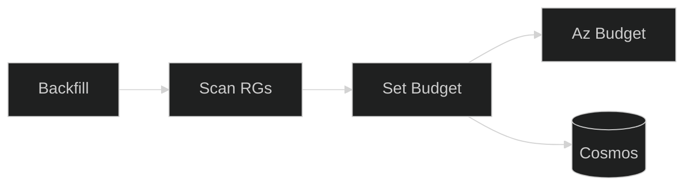

The `/api/backfill` endpoint scans all RGs in the subscription, creates an Azure native budget on each one that doesn't have one, and seeds a Cosmos DB inventory row.

### For New RGs (auto-created)

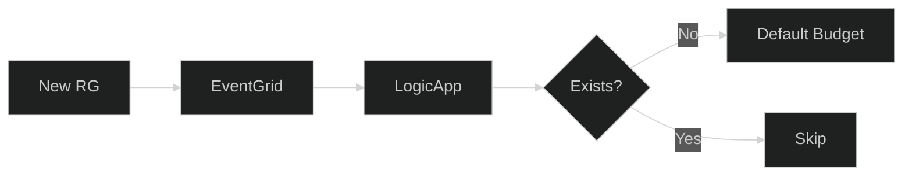

### Finance Budget (top-down)

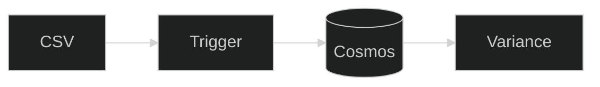

Finance drops a CSV into the `finance-budgets/` container. The blob trigger function auto-ingests per-RG finance budget amounts. Only active when `enableFinanceBudget=true`.

---

## Alert Flow

The Function App evaluates each RG daily, classifies its spend tier from the budget amount, and dispatches tiered alerts with tag-based recipients.

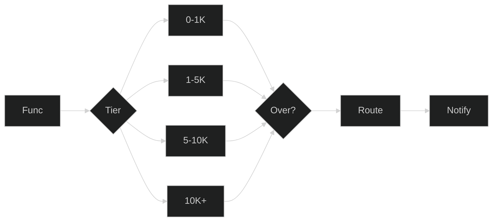

**Recommended RG tags for alert routing:**

| Tag Key | Example Value | Used At |
|---------|--------------|--------|
| `Owner` | `team-lead@contoso.com` | Warning+, budget change access control |
| `TechnicalContact1` | `engineer1@contoso.com` | All alert levels (HeadUp+) |
| `TechnicalContact2` | `engineer2@contoso.com` | All alert levels (HeadUp+) |
| `BillingContact` | `billing@contoso.com` | Warning + Critical alerts |
| `CostCenter` | `BU-Engineering` | Spend grouping in dashboards |

---

## Budget Alert Notification Framework

Thresholds are **not fixed** — they scale by the RG's budget amount. Smaller RGs tolerate higher variance; larger RGs get tighter controls. Each tier has three severity levels with escalating recipients.

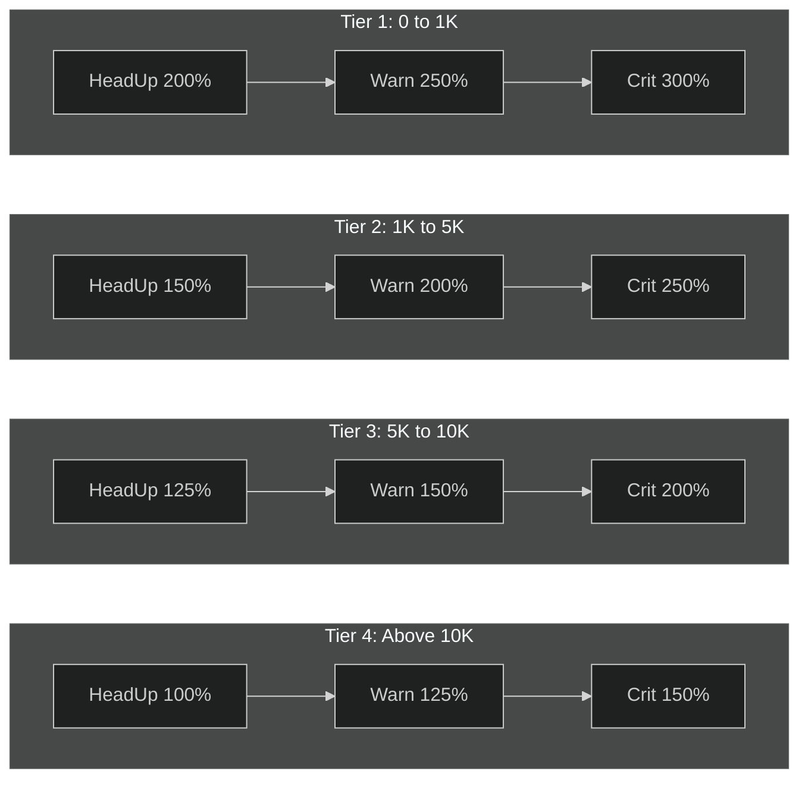

### Threshold Matrix

| Spend Tier (Budget Amount) | HeadUp | Warning | Critical |
|---------------------------|--------|---------|----------|
| **$0 – $1K** | 200% | 250% | 300% |
| **$1K – $5K** | 150% | 200% | 250% |
| **$5K – $10K** | 125% | 150% | 200% |
| **Above $10K** | 100% | 125% | 150% |

### Recipient Escalation

| Severity | Recipients |
|----------|------------|
| **HeadUp** | Owner, TechnicalContact1, TechnicalContact2 |
| **Warning** | Owner, TechnicalContact1, TechnicalContact2, BillingContact |
| **Critical** | Owner, TechnicalContact1, TechnicalContact2, BillingContact, Governance |

### Governance Tag Alert

Any RG with a configured governance tag value triggers an immediate Governance notification — regardless of spend level. Configure via `GOVERNANCE_TAG_KEY` and `GOVERNANCE_TAG_VALUE` environment variables.

---

## Dashboard & API

| Endpoint | URL | Returns |
|----------|-----|---------|
| Full inventory | `/api/inventory` | All RGs with budgets, spend, status |
| Filter by status | `/api/inventory?status=over_budget` | Only over-budget RGs |
| Finance variance | `/api/variance` | Finance vs Technical budget comparison |
| Manual evaluation | `/api/evaluate` | Triggers daily evaluation on-demand |
| Manual recalc | `/api/recalculate` | Quarterly budget recalculation |
| Update budget | `/api/update-budget` | Update technicalBudget in Cosmos DB (called by Logic App) |
| Backfill | `/api/backfill?subscriptionId=...&dryRun=true` | Scan + create budgets for existing RGs |

**Dashboard options:**
- **Azure Workbook** (deployed automatically) — Compliance pie chart, inventory table, top spenders bar chart, burn rate analysis. Queries `FinOpsInventory_CL` in Log Analytics.
- **Power BI** — connect to Cosmos DB directly or via `/api/inventory` (templates in `powerbi/`)
- **Cosmos DB Data Explorer** — run SQL queries directly (examples in `queries/`)

---

## Scripts Reference

| Script | Purpose | When to Run |
|--------|---------|-------------|
| `Invoke-BudgetBackfill.ps1` | Create budgets for all existing RGs | Initial rollout + quarterly |
| `Initialize-BudgetTable.ps1` | Seed Cosmos DB from existing Azure budgets | After backfill |
| `Set-FinanceBudget.ps1` | Load finance department budget targets | When finance provides CSV |
| `New-AmortizedExport.ps1` | Create daily amortized cost export | Once (starts data flow) |
| `Invoke-QuarterlyRecalc.ps1` | Re-adjust budgets from last quarter's actuals | Quarterly |
| `Enable-AdminFeatures.ps1` | Assign RBAC + deploy policy (needs Owner) | Once per subscription |
| `Seed-CosmosDemo.ps1` | Insert demo data for testing | Development only |

---

## Key Decisions

| Decision | Rationale |
|----------|-----------|
| **Cosmos DB over Table Storage** | Rich queries, Power BI connector, change feed, serverless |
| **Custom Function over native budgets** | Native budgets = actual cost only. Amortized cost monitoring requires custom solution |
| **Default budget per RG** | Eliminates noise from micro-RGs with trivial spend |
| **Tiered alert thresholds** | Low-spend RGs ($0–$1K) alert at 200%+; high-spend ($10K+) alert at 100% — reduces noise, focuses on material risk |
| **Event Grid + Logic App over Policy** | Azure Policy can't create budgets (not ARM-native) |
| **Cost Management API fallback** | Immediate cost visibility on first deploy — no 24h wait for export CSV |
| **10% buffer on budget** | Prevents false alerts from normal spend fluctuation |
| **Finance + Technical dual budget** | Optional exec view: finance expectation vs reality (toggle via `enableFinanceBudget`) |
| **DCR over shared keys** | Managed Identity authentication for LAW ingestion — no secrets to rotate |

---

## RBAC Assignments

### Function App Managed Identity

| Role | Scope | Purpose |
|------|-------|---------|
| **Storage Blob Data Owner** | Storage Account | Read cost export CSVs, write finance CSVs |
| **Storage Queue Data Contributor** | Storage Account | Function runtime queue processing |
| **Storage Table Data Contributor** | Storage Account | Function runtime table access |
| **Storage Account Contributor** | Storage Account | Function runtime file share management |
| **Cosmos DB SQL Data Contributor** | Cosmos DB Account | Read/write inventory documents (SQL RBAC) |
| **Log Analytics Contributor** | Resource Group | Write data to Log Analytics workspace |
| **Cost Management Reader** | Subscription | Read cost data via Cost Management API |
| **Monitoring Metrics Publisher** | Resource Group | DCR ingestion via Logs Ingestion API |

### Logic App Managed Identities

| Logic App | Role | Scope | Purpose |
|-----------|------|-------|---------|
| `la-finops-auto-budget` | Cost Management Contributor | Subscription | Create budgets on new RGs |
| `la-finops-budget-change` | Cost Management Contributor | Subscription | Update budgets on existing RGs |
| `la-finops-backfill` | Reader | Subscription | Enumerate resource groups for backfill |

### Post-Deploy Identity (User-Assigned MI)

| Role | Scope | Purpose |
|------|-------|---------|
| Contributor | Resource Group | Upload Function App code, configure resources |
| Cost Management Contributor | Subscription | Create cost export |

---

## Log Analytics — FinOpsInventory_CL

The Function App syncs Cosmos DB inventory to Log Analytics after every evaluation via **Data Collection Rule (DCR)** using Managed Identity — no shared keys.

**Table:** `FinOpsInventory_CL` in `law-finops-budget`

**Data flow:** Cosmos DB → Function App `_sync_inventory_to_law()` → DCR / Logs Ingestion API → LAW → Workbook KQL queries + Scheduled Query Rules

**Key columns:** `resourceGroup`, `technicalBudget`, `financeBudget`, `amortizedMTD`, `forecastEOM`, `actualPct`, `forecastPct`, `burnRateDaily`, `complianceStatus`, `costCenter`, `ownerEmail`, `spendTier`, `scope`, `totalResourceGroups`

**Workbook queries** use `arg_max(TimeGenerated, *)` grouped by `resourceGroup` to always show the latest sync batch.

**Ingestion latency:** DCR returns HTTP 204 immediately; data appears in LAW within 2–5 minutes.

---

## Alerting Architecture

Amortized cost alerts use Azure Monitor Scheduled Query Rules that query LAW hourly and fire through the Action Group.


| Alert Rule | Severity | Condition | Fires When |
|-----------|----------|-----------|------------|
| `finops-alert-headup` | Sev 3 (Info) | `complianceStatus == 'at_risk'` | HeadUp threshold crossed |
| `finops-alert-warning` | Sev 2 (Warning) | `complianceStatus == 'warning'` | Warning threshold crossed |
| `finops-alert-critical` | Sev 1 (Error) | `complianceStatus == 'over_budget'` | Critical threshold crossed |

**Evaluation frequency:** Every 1 hour. Queries the latest sync batch in LAW.

---

## Finance Budget Ingestion

Finance drops CSV into blob → Function auto-ingests to Cosmos DB. **Zero manual steps.**

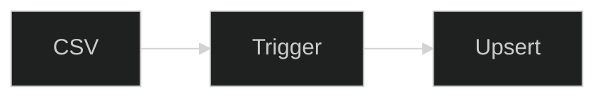

Finance drops a CSV into the `finance-budgets/` Storage container. The `ingest_finance_budget` blob trigger function auto-parses and upserts to Cosmos DB.

**CSV format:** `SubscriptionId, ResourceGroup, FinanceBudget, CostCenter`

> Only active when `enableFinanceBudget=true`. When disabled, the blob trigger still works but finance budget values are not synced to the workbook dashboard.

---

## ITSM Integration Patterns

Organizations using IT Service Management platforms (ServiceNow, Jira Service Management, etc.) can integrate the FinOps platform for budget lifecycle management.

### Integration Options

| Approach | How | Best For |
|----------|-----|----------|
| **Outbound REST** | ITSM workflow calls `/api/update-budget` via HTTPS | Real-time, low complexity |
| **Logic App Connector** | Logic App polls ITSM for new budget requests | No outbound from ITSM needed |
| **Service Bus** | ITSM drops message to queue; Logic App picks up | Decoupled, reliable delivery |
| **Blob Drop** | ITSM exports CSV to blob; blob trigger ingests | Batch, reuses finance pipeline |

### API Contract

**Budget creation / update** — `POST /api/update-budget`

```json
{
  "subscriptionId": "<subscription-id>",
  "resourceGroupName": "rg-workload-prod",
  "newBudgetAmount": 15000,
  "requestorEmail": "rg-owner@contoso.com",
  "reason": "New project budget allocation"
}
```

Response: `{ "status": "cosmos_updated", "oldBudget": 0, "newBudget": 15000 }`

**Read inventory** — `GET /api/inventory`

Returns array of all RG budget documents. ITSM can consume this to populate CMDB fields.

---

## Budget Change Governance

### Blocking Manual Budget Changes

To enforce that all budget changes go through the approved workflow, deploy an Azure Policy **deny** rule that blocks direct writes to `Microsoft.Consumption/budgets` unless the caller is a managed identity (Function App or Logic App).

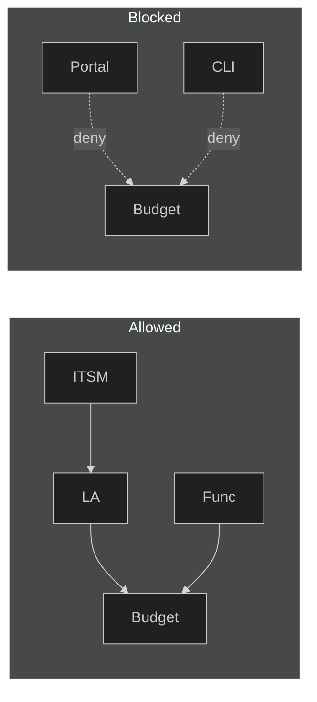

### Approval Workflow for Large Budget Changes

| Change Size | Flow |
|------------|------|
| Within floor–cap range | Auto-approved → Logic App executes immediately |
| Exceeds cap | Requires approval → route to FinOps manager → on approval, call Logic App |
| Very large budget | Requires leadership approval before execution |

---

## CI/CD & Multi-Subscription Scaling

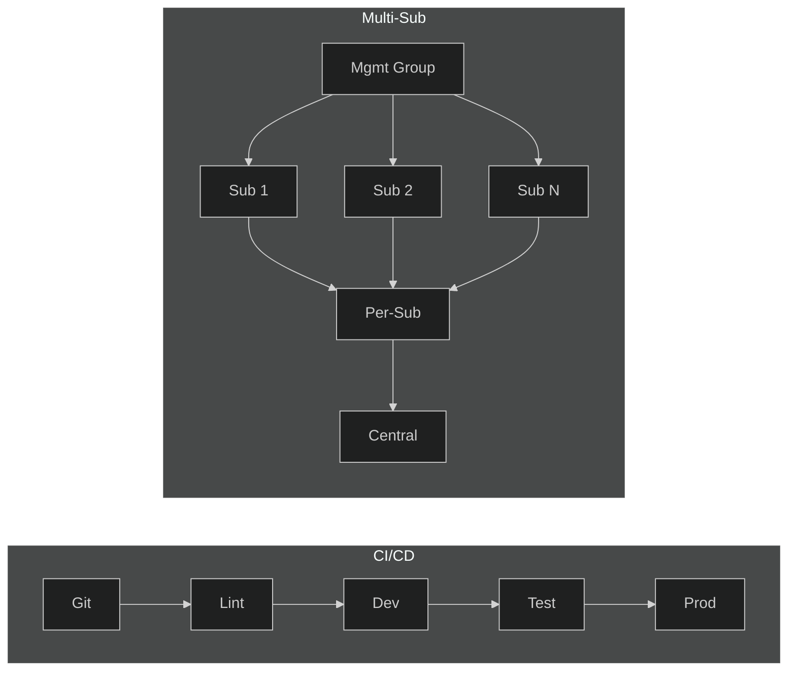

**Centralized vs Per-Subscription:**
- **Centralized (one instance):** Cosmos DB, Function App, Dashboard, Action Group — shared across all subscriptions
- **Per-subscription (replicated):** Azure Budgets, Policy Assignment, Event Grid, Cost Export — deployed to each subscription via pipeline parameter matrix

See [CI/CD Deployment Guide](../docs/cicd-guide.md) for production pipeline setup.

---

*Azure Amortized Cost Management — 20+ deployed resources, 9 Function App endpoints, tiered notification framework, DCR-based LAW integration, 3 Scheduled Query Rules.*
